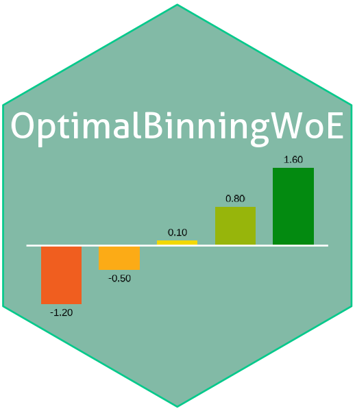

<!-- README.md is generated from README.Rmd. Please edit that file -->

```{r, include = FALSE}
knitr::opts_chunk$set(
  collapse = TRUE,
  comment = "#>",
  fig.path = "man/figures/README-",
  out.width = "100%"
)
```


<!-- README.md is generated from README.Rmd. Please edit that file -->

# OptimalBinningWoE <a href="https://evandeilton.github.io/OptimalBinningWoE/"></a>

<!-- badges: start -->

[](https://github.com/evandeilton/OptimalBinningWoE/actions/workflows/R-CMD-check.yaml)
[](https://opensource.org/licenses/MIT)

<!-- [](https://cran.r-project.org/package=OptimalBinningWoE) -->
<!-- badges: end -->

## Introduction

`OptimalBinningWoE` is an R package designed to perform optimal binning
and calculate Weight of Evidence (WoE) for both numerical and
categorical features. It implements a variety of advanced binning
algorithms to discretize continuous variables and optimize categorical
variables for predictive modeling, particularly in credit scoring and
risk assessment applications.

The package supports automatic method selection, data preprocessing, and
handles both numerical and categorical features. It aims to maximize the
predictive power of features while maintaining interpretability through
monotonic binning and information value optimization.

## Key Concepts

### Weight of Evidence (WoE)

Weight of Evidence is a measure used to encode categorical variables in
logistic regression, particularly in credit scoring. It quantifies the
predictive power of a feature by comparing the distribution of good and
bad cases across bins.

For bin $i$: $$\text{WoE}_i = \ln\left(\frac{P(X_i | Y = 1)}{P(X_i | Y = 0)}\right),$$ where: - $P(X_i | Y = 1)$ is the proportion of positive cases (e.g.,
defaults) in bin $i$, - $P(X_i | Y = 0)$ is the proportion of negative
cases (e.g., non-defaults) in bin $i$.

### Information Value (IV)

Information Value quantifies the overall predictive power of a feature.
It is calculated as the sum of the WoE differences between good and bad
cases across all bins.

For bin $i$: $$\text{IV}_i = \left(P(X_i | Y = 1) - P(X_i | Y = 0)\right) \times \text{WoE}_i.$$ The total Information Value is: $$\text{IV}_{\text{total}} = \sum_{i=1}^{n} \text{IV}_i$$

Interpretation of IV values:

- **IV \< 0.02**: Not Predictive
- **0.02 ≤ IV \< 0.1**: Weak Predictive Power
- **0.1 ≤ IV \< 0.3**: Medium Predictive Power
- **0.3 ≤ IV \< 0.5**: Strong Predictive Power
- **IV ≥ 0.5**: Suspicious or Overfitting

## Supported Algorithms

### For Categorical Variables

- **Fisher’s Exact Test Binning (FETB)**: Uses Fisher’s exact test to
  merge categories with similar target distributions.
- **ChiMerge (CM)**: Merges categories based on chi-square statistics to
  ensure homogeneous bins.
- **Unsupervised Decision Trees (UDT)**: Applies decision tree
  algorithms for unsupervised categorical binning.
- **Information Value Binning (IVB)**: Bins categories based on
  maximizing Information Value.
- **Greedy Monotonic Binning (GMB)**: Creates monotonic bins using a
  greedy approach.
- **Sliding Window Binning (SWB)**: Adapts the sliding window method for
  categorical variables.
- **Dynamic Programming with Local Constraints (DPLC)**: Applies dynamic
  programming for optimal binning with local constraints.
- **Monotonic Optimal Binning (MOB)**: Ensures monotonicity in WoE
  across categories.
- **Modified Binning Algorithm (MBA)**: A modified approach tailored for
  categorical variable binning.
- **Mixed Integer Linear Programming (MILP)**: Uses MILP to find the
  optimal binning solution.
- **Simulated Annealing Binning (SAB)**: Applies simulated annealing for
  binning optimization.

### For Numerical Variables

- **Unsupervised Decision Trees (UDT)**: Utilizes decision tree
  algorithms in an unsupervised manner.
- **Minimum Description Length Principle (MDLP)**: Implements MDLP
  criterion for optimal binning.
- **Monotonic Optimal Binning (MOB)**: Ensures monotonicity in WoE
  across bins.
- **Monotonic Binning via Linear Programming (MBLP)**: Uses linear
  programming to achieve monotonic binning.
- **Dynamic Programming with Local Constraints (DPLC)**: Employs dynamic
  programming for numerical variables.
- **Local Polynomial Density Binning (LPDB)**: Uses local polynomial
  density estimation.
- **Unsupervised Binning with Standard Deviation (UBSD)**: Bins based on
  standard deviation intervals.
- **Fisher’s Exact Test Binning (FETB)**: Applies Fisher’s exact test to
  numerical variables.
- **Equal Width Binning (EWB)**: Creates bins of equal width across the
  variable’s range.
- **K-means Binning (KMB)**: Uses k-means clustering for binning.
- **Optimal Supervised Learning Path (OSLP)**: Finds optimal bins using
  supervised learning paths.
- **Monotonic Regression-Based Linear Programming (MRBLP)**: Combines
  monotonic regression with linear programming.
- **Isotonic Regression (IR)**: Uses isotonic regression for binning.
- **Branch and Bound (BB)**: Employs branch and bound algorithm for
  optimal binning.
- **Local Density Binning (LDB)**: Utilizes local density estimation for
  binning.

## Installation

Install the development version from GitHub:

``` r
# install.packages("devtools")
devtools::install_github("evandeilton/OptimalBinningWoE")
```

## Usage

The main function provided by the package is `obwoe()`, which performs
optimal binning and WoE calculation.

### Function Signature

``` r
obwoe(
  dt,
  target,
  features = NULL,
  method = "auto",
  preprocess = TRUE,
  outputall = TRUE,
  min_bins = 3,
  max_bins = 4,
  positive = "bad|1",
  progress = TRUE,
  trace = TRUE,
  control = list(...)
)
```

### Arguments

- **dt**: A `data.table` containing the dataset.
- **target**: The name of the binary target variable.
- **features**: Vector of feature names to process. If `NULL`, all
  features except the target will be processed.
- **method**: The binning method to use. Can be `"auto"` or one of the
  methods listed in the Supported Algorithms section.
- **preprocess**: Logical. Whether to preprocess the data before binning
  (default: `TRUE`).
- **outputall**: Logical. If `TRUE`, returns detailed output including
  data, binning information, and reports (default: `TRUE`).
- **min_bins**: Minimum number of bins (default: `3`).
- **max_bins**: Maximum number of bins (default: `4`).
- **positive**: Specifies which category should be considered as
  positive (e.g., `"bad|1"` or `"good|1"`).
- **progress**: Logical. Whether to display a progress bar (default:
  `TRUE`).
- **trace**: Logical. Whether to generate error logs when testing
  existing methods (default: `TRUE`).
- **control**: A list of additional control parameters (see below).

### Control Parameters

The `control` list allows fine-tuning of the binning process:

- **cat_cutoff**: Minimum frequency for a category (default: `0.05`).
- **bin_cutoff**: Minimum frequency for a bin (default: `0.05`).
- **min_bads**: Minimum proportion of bad cases in a bin (default:
  `0.05`).
- **pvalue_threshold**: P-value threshold for statistical tests
  (default: `0.05`).
- **max_n_prebins**: Maximum number of pre-bins (default: `20`).
- **monotonicity_direction**: Direction of monotonicity (“increase” or
  “decrease”).
- **lambda**: Regularization parameter for some algorithms (default:
  `0.1`).
- **min_bin_size**: Minimum bin size as a proportion of total
  observations (default: `0.05`).
- **min_iv_gain**: Minimum IV gain for bin splitting (default: `0.01`).
- **max_depth**: Maximum depth for tree-based algorithms (default:
  `10`).
- **num_miss_value**: Value to replace missing numeric values (default:
  `-999.0`).
- **char_miss_value**: Value to replace missing categorical values
  (default: `"N/A"`).
- **outlier_method**: Method for outlier detection (`"iqr"`, `"zscore"`,
  or `"grubbs"`).
- **outlier_process**: Whether to process outliers (default: `FALSE`).
- **iqr_k**: IQR multiplier for outlier detection (default: `1.5`).
- **zscore_threshold**: Z-score threshold for outlier detection
  (default: `3`).
- **grubbs_alpha**: Significance level for Grubbs’ test (default:
  `0.05`).
- **n_threads**: Number of threads for parallel processing (default:
  `1`).
- **is_monotonic**: Whether to enforce monotonicity in binning (default:
  `TRUE`).
- **population_size**: Population size for genetic algorithm (default:
  `50`).
- **max_generations**: Maximum number of generations for genetic
  algorithm (default: `100`).
- **mutation_rate**: Mutation rate for genetic algorithm (default:
  `0.1`).
- **initial_temperature**: Initial temperature for simulated annealing
  (default: `1`).
- **cooling_rate**: Cooling rate for simulated annealing (default:
  `0.995`).
- **max_iterations**: Maximum number of iterations for iterative
  algorithms (default: `1000`).
- **include_upper_bound**: Include upper bound for numeric bins
  (default: `TRUE`).
- **bin_separator**: Separator for bins in categorical variables
  (default: `"%;%"`).

## Examples

### Example 1: Using the German Credit Data

``` r
library(OptimalBinningWoE)
library(data.table)
library(scorecard)

# Load the German Credit dataset
data(germancredit, package = "scorecard")
dt <- as.data.table(germancredit)

# Process all features with Monotonic Binning via Linear Programming (MBLP) method
result <- obwoe(
  dt,
  target = "creditability",
  method = "auto",
  min_bins = 3,
  max_bins = 3,
  positive = "bad|1",
  features = c("age.in.years", "purpose"),
  control = list(bin_separator = "'+'")
)

# View WoE binning information
result$woebin[, 1:7] %>%
  knitr::kable()
```

### Example 2: Detailed Output with Numeric Features

``` r
# Select numeric features excluding the target
numeric_features <- names(dt)[sapply(dt, is.numeric)]
numeric_features <- setdiff(numeric_features, "creditability")

# Process numeric features with detailed output
result_detailed <- obwoe(
  dt,
  target = "creditability",
  features = numeric_features,
  method = "auto",
  preprocess = TRUE,
  outputall = TRUE,
  min_bins = 3,
  max_bins = 3,
  positive = "bad|1"
)

# View WoE-transformed data
result_detailed$data[, 1:4] %>%
  head(5) %>%
  knitr::kable()

# View best model report
result_detailed$report_best_model[, 1:5] %>%
  head(5) %>%
  knitr::kable()

# View preprocessing report
# print(result_detailed$report_preprocess)
```

### Example 3: Processing Categorical Features with Unsupervised Decision Trees

``` r
# Select categorical features excluding the target
categoric_features <- names(dt)[sapply(dt, function(i) !is.numeric(i))]
categoric_features <- setdiff(categoric_features, "creditability")

# Process categorical features with UDT method
result_cat <- obwoe(
  dt,
  target = "creditability",
  features = categoric_features,
  method = "udt",
  preprocess = TRUE,
  min_bins = 3,
  max_bins = 4,
  positive = "bad|1"
)

# View binning information for categorical features
result_cat$woebin[, 1:7] %>% knitr::kable()
```

## Use Recommendations

- **Method Selection**: When `method = "auto"`, the function tests
  multiple algorithms and selects the one that produces the highest
  total Information Value while respecting the specified constraints.
- **Monotonicity**: Enforcing monotonicity in binning
  (`is_monotonic = TRUE`) is recommended for credit scoring models to
  ensure interpretability.
- **Preprocessing**: It’s advisable to preprocess data
  (`preprocess = TRUE`) to handle missing values and outliers
  effectively.
- **Bin Constraints**: Adjust `min_bins` and `max_bins` according to the
  feature’s characteristics and the desired level of granularity.
- **Control Parameters**: Fine-tune the `control` parameters to optimize
  the binning process for your specific dataset.

## References

- Siddiqi, N. (2006). **Credit Risk Scorecards: Developing and
  Implementing Intelligent Credit Scoring**. John Wiley & Sons.
- Hand, D. J., & Henley, W. E. (1997). **Statistical classification
  methods in consumer credit scoring: a review**. Journal of the Royal
  Statistical Society: Series A (Statistics in Society), 160(3),
  523-541.
- Thomas, L. C., Edelman, D. B., & Crook, J. N. (2002). **Credit Scoring
  and Its Applications**. SIAM.

## Contributing

Contributions are welcome! Please open an issue or submit a pull request
on [GitHub](https://evandeilton.github.io/OptimalBinningWoE/).

## License

This project is licensed under the MIT License - see the
[LICENSE](https://opensource.org/licenses/MIT) for details.

------------------------------------------------------------------------
