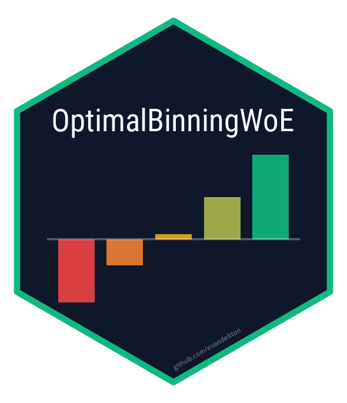
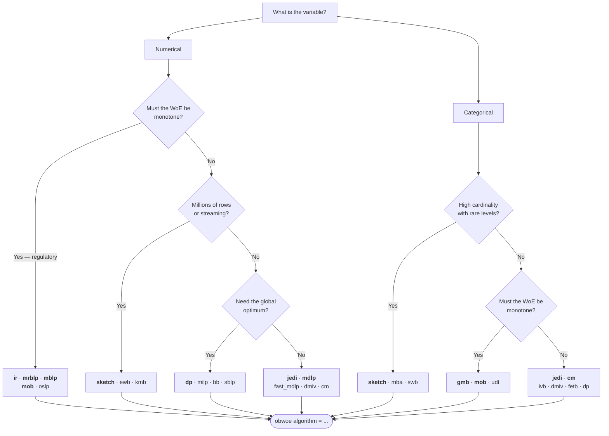

<!-- README.md is generated from README.Rmd. Please edit that file -->


# OptimalBinningWoE <a href="https://evandeilton.github.io/OptimalBinningWoE/"></a>

<!-- badges: start -->
[](https://CRAN.R-project.org/package=OptimalBinningWoE)
[](https://github.com/evandeilton/OptimalBinningWoE/actions/workflows/R-CMD-check.yaml)
[](https://cran.r-project.org/package=OptimalBinningWoE)
[](https://opensource.org/licenses/MIT)
[](https://lifecycle.r-lib.org/articles/stages.html#stable)
<!-- badges: end -->

Optimal binning and Weight of Evidence transformation for credit scoring and
risk modelling, with 36 C++ binning algorithms behind one R interface.

The package covers the whole path from a raw feature store to a deployed
scorecard: fit the binning, screen the variables against IV strength and bin
ordering, transform the data, and export the same transformation as SQL so the
scoring runs where the data lives.

| | |
|---|---|
| **36 algorithms** | 20 numerical, 16 categorical — entropy, $\chi^2$, exact optimisation, shape-constrained and streaming methods |
| **C++ engine** | Rcpp/RcppEigen throughout; 500 variables over 20,000 rows bin and screen in about two seconds |
| **Automated screening** | `obwoe_select()` returns a verdict and a reason for every candidate, never dropping a row |
| **In-database scoring** | `obwoe_sql()` emits exact `CASE` expressions for 14 SQL dialects |
| **Regulatory fit** | monotonic binning, auditable bin-level evidence, reason codes |
| **tidymodels ready** | `step_obwoe()` is a first-class, tunable `recipes` step |

## Installation

```r
install.packages("OptimalBinningWoE")

# development version
# install.packages("pak")
pak::pak("evandeilton/OptimalBinningWoE")
```

## Quick start

The Statlog (German Credit) benchmark ships with the package, so the example
below runs as-is.


```r
library(OptimalBinningWoE)

german <- read.csv(
  gzfile(system.file("extdata", "germancredit.csv.gz",
                     package = "OptimalBinningWoE")),
  stringsAsFactors = FALSE
)
german$default <- 1L - german$credit_risk
german$credit_risk <- NULL

model <- obwoe(german, target = "default", min_bins = 2, max_bins = 6)
summary(model)
```

## The four steps

**1. Fit.** One call bins every column, routing numerical and categorical
variables to the right algorithm.


```r
model <- obwoe(german, target = "default", max_bins = 6)
```

**2. Screen.** `obwoe_select()` applies the two criteria that govern variable
admission — Information Value strength and guaranteed rank ordering — and
returns one row per candidate with the decision and the reason behind it.


```r
sel <- obwoe_select(model)
sel[, c("feature", "total_iv", "iv_class", "ks", "monotonic", "selected", "reason")]
#>            feature total_iv     iv_class      ks monotonic selected        reason
#> 1:  credit_history   0.2932       Medium  0.1805      TRUE     TRUE            OK
#> 2:        duration   0.2727       Medium  0.1900      TRUE     TRUE            OK
#> ...
#> 14:         status   0.6660   Suspicious  0.3671      TRUE    FALSE IV_SUSPICIOUS
#> 15: number_credits   0.0101 Unpredictive  0.0481      TRUE    FALSE  IV_BELOW_MIN
```

`status` is the strongest variable in the file and is rejected for it: an IV
above 0.50 is far more often leakage than signal. Nothing is silently dropped —
500 candidates return 500 rows, so the automatic verdict can be reviewed.

**3. Transform.** Apply the fitted binning to any frame, in R or inside a
`recipes` pipeline.


```r
scored <- obwoe_apply(new_data, model)

rec <- recipes::recipe(default ~ ., data = german) |>
  step_obwoe(recipes::all_predictors(), outcome = "default", max_bins = 6)
```

**4. Deploy.** Export the same transformation as SQL.


```r
obwoe_sql(model, table = "risk.applications",
          features = sel$feature[sel$selected], dialect = "postgres")
```

```sql
CASE
    WHEN duration IS NULL THEN 0
    WHEN duration <= 7 THEN -1.3121863889661687
    WHEN duration > 7 AND duration <= 10 THEN -0.45198512374305744
    WHEN duration > 10 AND duration <= 16 THEN -0.3028722379457563
    WHEN duration > 16 AND duration <= 33 THEN 0.10461674470498177
    WHEN duration > 33 AND duration <= 39 THEN 0.5728610146854435
    WHEN duration > 39 THEN 0.993901334579079
    ELSE 0
END AS duration_woe
```

Intervals are half-open on the right, `(a, b]`, reproducing `obwoe_apply()`
exactly; cut points are written at full round-trip precision; and every
expression opens with an explicit `IS NULL` branch, because `NULL <= 5` is
`NULL` in SQL, not `FALSE`.

## The whole pipeline in one call

`obwoe_scorecard()` runs the four steps above end to end — split, bin, screen
by IV and correlation, fit, scale to points — and writes the result as an
`.xlsx` model document.


```r
card <- obwoe_scorecard(
  german,
  target = "default",
  split  = 0.7,
  engine = "glm",
  file   = "scorecard.xlsx"
)

card
head(card$points[, c("variable", "bin", "woe", "points")])
predict(card, german, type = "score")
```

The workbook holds thirteen sheets: the model summary, the scorecard points
table, the coefficients with standard errors, the bin statistics of the
variables that entered, the screening funnel with a reason per rejected
variable, the correlation matrix before and after pruning, score gains, PSI
stability between samples, a cut-off strategy table, the deployment SQL in both
WoE and points form, and a reproducibility record.

Three properties are enforced rather than assumed. The binning is fitted on the
**training rows only**, so the hold-out numbers are not inflated by supervised
leakage. A variable whose WoE coefficient comes out negative — the WoE already
carries the direction, so a negative slope means the model is reversing it — is
dropped and the model refitted. And the generated points SQL reproduces the R
card score **exactly**, unseen categories included.

## Vignettes

Two long-form articles carry the detailed documentation and worked cases.

**[Optimal Binning and Weight of Evidence: A Practical Guide](https://evandeilton.github.io/OptimalBinningWoE/articles/introduction.html)**
— the working reference. What WoE and IV measure and why monotonicity of the
event rate and of the WoE are the same statement; reading a bin table and a
gains table; screening a whole base with `obwoe_select()`; how the algorithm
families differ and how to pick one; applying the transformation to new data;
exporting to SQL; preprocessing missing values and outliers. Uses the bundled
German Credit benchmark throughout.

**[An Industrial Scorecard Pipeline](https://evandeilton.github.io/OptimalBinningWoE/articles/industrial-pipeline.html)**
— an origination scorecard built the way a risk department builds one. A wide
synthetic base carrying the pathologies that matter (missing bureau data, rare
dealer codes, near-duplicate vendor fields, pure noise, and a leaky
post-booking field), screening at scale, redundancy pruning with `obcorr()` in
the WoE space, a `recipes` pipeline around `step_obwoe()`, logistic regression
with the coefficient sign check, scorecard points and PDO scaling, out-of-time
validation with gains and PSI, deployment to SQL, tuning with tidymodels, and
the governance checklist that closes a model document.

## Choosing an algorithm

Three questions settle it in practice.



Bold entries are the defaults worth trying first. `algorithm = "auto"` picks
`jedi`, a good general-purpose choice for both types.

| Family | Algorithms | Optimises |
|---|---|---|
| Information-theoretic | `mdlp`, `fast_mdlp`, `dmiv`, `ivb`, `jedi` | entropy or IV gain per split, with an MDL stopping rule |
| Statistical merging | `cm`, `fetb`, `mob` | merges neighbours whose difference fails a $\chi^2$ or Fisher test |
| Shape-constrained | `ir`, `mrblp`, `mblp`, `oslp`, `gmb` | best fit subject to a monotonicity constraint |
| Exact optimisation | `dp`, `milp`, `sblp`, `bb` | global optimum of IV under bin-count and size constraints |
| Metaheuristic | `sab`, `mba`, `swb`, `udt` | simulated annealing, agglomerative or tree-based search |
| Unsupervised | `ewb`, `kmb`, `ubsd`, `sketch` | equal width, k-means, standard deviation, streaming quantiles |

`obwoe_algorithms()` lists all 36 with the feature types each supports; every
one is also callable directly as `ob_numerical_*()` or `ob_categorical_*()`.

## Key functions

| Function | Purpose |
|---|---|
| `obwoe()` | Fit optimal binning and WoE across a data frame |
| `obwoe_select()` | Screen variables by IV strength and bin ordering |
| `obwoe_apply()` | Apply a fitted binning to new data |
| `obwoe_gains()` | Gains table with KS, Gini, lift and capture rates |
| `obwoe_sql()` | Generate the equivalent SQL `CASE` expressions |
| `obwoe_scorecard()` | Run the full pipeline and write the `.xlsx` model document |
| `obwoe_report()` | Write the workbook for an existing scorecard |
| `obwoe_scale()` / `obwoe_score()` | PDO scaling of log-odds to points |
| `obwoe_prune()` | Drop redundant variables by correlation in the WoE space |
| `obwoe_psi()` | Population Stability Index between two samples |
| `step_obwoe()` | tidymodels recipe step, tunable |
| `obcorr()` | Fast pairwise correlations for redundancy pruning |
| `ob_preprocess()` | Missing-value and outlier handling before binning |
| `obwoe_algorithms()` | List the available algorithms |
| `control.obwoe()` | Algorithm control parameters |

## Interpreting Information Value

The package grades IV with the bands from Siddiqi (2006), and
`obwoe_select()` acts on them.

| IV | Band | Reading |
|---|---|---|
| $< 0.02$ | Unpredictive | drop |
| $[0.02,\ 0.10)$ | Weak | keep only if it adds diversity |
| $[0.10,\ 0.30)$ | Medium | the workhorses of a scorecard |
| $[0.30,\ 0.50)$ | Strong | strong, verify it is not a proxy |
| $\ge 0.50$ | Suspicious | almost always leakage |

## Documentation

- [Function reference](https://evandeilton.github.io/OptimalBinningWoE/reference/)
- [Practical guide](https://evandeilton.github.io/OptimalBinningWoE/articles/introduction.html)
- [Industrial pipeline](https://evandeilton.github.io/OptimalBinningWoE/articles/industrial-pipeline.html)
- [Issue tracker](https://github.com/evandeilton/OptimalBinningWoE/issues)

## Contributing

Contributions are welcome. See the
[Contributing Guidelines](https://github.com/evandeilton/OptimalBinningWoE/blob/main/CONTRIBUTING.md)
and the
[Code of Conduct](https://github.com/evandeilton/OptimalBinningWoE/blob/main/CODE_OF_CONDUCT.md).

## Citation

```bibtex
@software{optimalbinningwoe,
  author = {José Evandeilton Lopes},
  title  = {OptimalBinningWoE: Optimal Binning and Weight of Evidence Framework for Modeling},
  year   = {2026},
  url    = {https://github.com/evandeilton/OptimalBinningWoE}
}
```

## References

- Siddiqi, N. (2006). *Credit Risk Scorecards: Developing and Implementing Intelligent Credit Scoring*. John Wiley & Sons.
- Thomas, L. C., Edelman, D. B., & Crook, J. N. (2002). *Credit Scoring and Its Applications*. SIAM.
- Navas-Palencia, G. (2020). Optimal Binning: Mathematical Programming Formulation. arXiv:2001.08025.
- Fayyad, U. M., & Irani, K. B. (1993). Multi-interval discretization of continuous-valued attributes for classification learning. *IJCAI*.
- Anderson, R. (2007). *The Credit Scoring Toolkit: Theory and Practice for Retail Credit Risk Management*. Oxford University Press.

## License

MIT License © 2026 José Evandeilton Lopes
