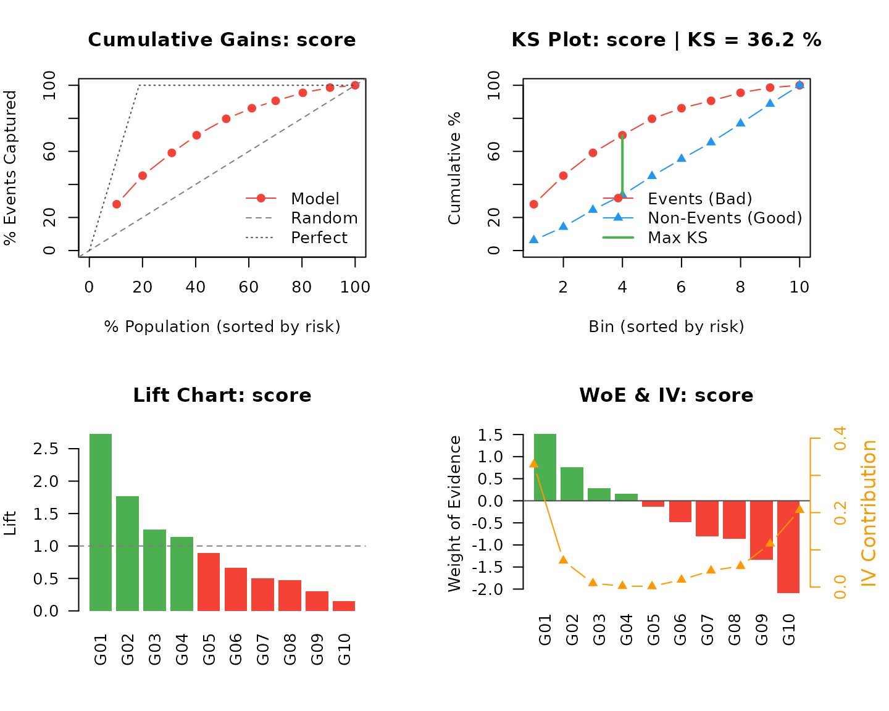

# An Industrial Scorecard Pipeline

The [practical
guide](https://evandeilton.github.io/OptimalBinningWoE/articles/introduction.md)
covers what each function computes. This vignette runs a full
origination scorecard the way it is run in a risk department: a wide
base with the pathologies real bases have, an out-of-time validation
window, a `recipes` pipeline that can be versioned and shipped, and the
artefacts a model governance committee asks for.

Everything below runs in a few seconds and uses only `recipes`, which
the package already imports.

``` r

library(OptimalBinningWoE)
library(recipes)
set.seed(20260819)
```

## The setting

An origination model is built once and lived with for years. The
constraints that shape the pipeline are not statistical:

- **The base is wide and mostly worthless.** Feature stores hand you
  hundreds of columns. Most carry nothing; a few carry the future.
- **Leakage is the default failure mode.** Fields populated after
  booking — collections activity, first-payment status — look
  spectacular in development and are unavailable at decision time.
- **The model must be defensible.** Every variable that enters needs a
  reason, and every variable that was dropped needs one too.
- **It must run where the data is.** The final artefact is usually SQL
  in a warehouse, not an R object.
- **It must be monitored.** A scorecard that was excellent last year and
  is never re-checked is a liability.

The pipeline below is organised around those five facts.

## A realistic origination base

The generator below produces an application base with the pathologies
that matter: skewed monetary fields, missing values in three fields, a
high-cardinality dealer code with rare levels, two near-duplicates of
variables already present, eight pure-noise columns, and one leaky field
populated only after the loan was booked.

``` r

make_base <- function(n, vintage) {
  age    <- pmax(18, round(rnorm(n, 41, 13)))
  income <- round(exp(rnorm(n, 8.1, 0.55)))
  tenure <- pmax(0, round(rexp(n, 1 / 48)))
  util   <- pmin(1.6, pmax(0, rbeta(n, 2, 4) + rnorm(n, 0, 0.08)))
  inq    <- rpois(n, 1.3)
  dlq    <- rpois(n, 0.35)
  bureau <- round(rnorm(n, 640, 85))
  ltv    <- pmin(1.3, pmax(0.1, rnorm(n, 0.72, 0.16)))

  region  <- sample(c("N", "NE", "CO", "SE", "S"), n, TRUE, c(.09, .27, .07, .42, .15))
  channel <- sample(c("branch", "broker", "digital", "partner"), n, TRUE, c(.34, .21, .33, .12))
  product <- sample(c("auto", "personal", "payroll", "card"), n, TRUE, c(.28, .35, .22, .15))
  occ     <- sample(c("salaried", "self_employed", "retired", "public", "informal"), n, TRUE)
  housing <- sample(c("owned", "rented", "family", "mortgaged"), n, TRUE, c(.31, .34, .20, .15))
  dealer  <- sample(c(LETTERS[1:3], paste0("Z", 1:14)), n, TRUE,
                    c(rep(.30, 3), rep(.10 / 14, 14)))

  lp <- -3.80 -
    0.019 * (age - 41) -
    0.55 * scale(log(income))[, 1] +
    1.35 * util +
    0.24 * inq + 0.42 * dlq -
    0.008 * (bureau - 640) +
    1.70 * ltv +
    0.30 * (channel == "broker") - 0.22 * (channel == "branch") +
    0.55 * (occ == "informal") - 0.40 * (occ == "public") +
    0.45 * (housing == "rented") - 0.006 * pmin(tenure, 120)
  y <- rbinom(n, 1, plogis(lp))

  # a second bureau vendor and a declared-income field: near-duplicates of
  # variables already in the base, which is what feature stores actually hand you
  bureau_alt <- round(0.80 * bureau + 0.20 * rnorm(n, 640, 85) + rnorm(n, 0, 35))
  income_declared <- round(income * exp(rnorm(n, 0, 0.15)))

  df <- data.frame(
    age, income, tenure_months = tenure, utilisation = util,
    inquiries_6m = inq, delinq_12m = dlq, bureau_score = bureau, ltv,
    bureau_alt, income_declared,
    region, channel, product, occupation = occ, housing,
    dealer_code = dealer, stringsAsFactors = FALSE
  )

  # eight columns of pure noise and four uninformative flags
  for (j in 1:8) df[[sprintf("noise_%02d", j)]] <- rnorm(n)
  for (j in 1:4) df[[sprintf("flag_%02d", j)]] <- sample(c("Y", "N"), n, TRUE)

  # populated only after booking: unavailable at decision time
  df$collections_after_booking <- ifelse(y == 1, rpois(n, 2.2), rpois(n, 0.05))

  df$utilisation[sample(n, n * 0.12)] <- NA
  df$tenure_months[sample(n, n * 0.07)] <- NA
  df$occupation[sample(n, n * 0.05)] <- NA

  df$vintage <- vintage
  df$default <- y
  df
}
```

Development is the first half of 2024; validation is the second half,
held out by time rather than at random. An out-of-time window is what
catches a model that has learned a vintage instead of a risk.

``` r

dev <- make_base(20000, "2024H1")
oot <- make_base(8000, "2024H2")

predictors <- setdiff(names(dev), c("default", "vintage"))
c(dev = nrow(dev), oot = nrow(oot), predictors = length(predictors))
#>        dev        oot predictors 
#>      20000       8000         29
c(dev_rate = mean(dev$default), oot_rate = mean(oot$default))
#> dev_rate oot_rate 
#>   0.1918   0.1874
```

### Missing values become levels

Binning treats a missing value as information, not as a gap to be
filled. The convention throughout the package is a numeric sentinel and
a character level, which the binner then places in its own bin — so
“utilisation was not reported” gets its own WoE instead of borrowing the
mean’s.

``` r

as_levels <- function(df) {
  num <- vapply(df, is.numeric, logical(1))
  df[num] <- lapply(df[num], function(v) replace(v, is.na(v), -999))
  df[!num] <- lapply(df[!num], function(v) replace(v, is.na(v), "MISSING"))
  df
}

dev <- as_levels(dev)
oot <- as_levels(oot)
```

[`ob_preprocess()`](https://evandeilton.github.io/OptimalBinningWoE/reference/ob_preprocess.md)
does the same job with outlier treatment attached when a variable needs
it; see the [practical
guide](https://evandeilton.github.io/OptimalBinningWoE/articles/introduction.html#preprocessing).

## Screening at scale

Bin everything first, decide afterwards. Binning all 29 candidates over
20,000 rows takes a fraction of a second, so there is no reason to
pre-filter by intuition.

``` r

binning <- obwoe(dev, target = "default", feature = predictors,
                 min_bins = 2, max_bins = 6)
binning
#> Optimal Binning Weight of Evidence
#> ===================================
#> 
#> Target: default ( binary )
#> Features processed: 29 
#> 
#> Results:  29  successful
#> 
#> Top features by IV:
#>   collections_after_booking: IV = 12.3276 (4 bins, jedi)
#>   bureau_score: IV = 0.2695 (6 bins, jedi)
#>   income_declared: IV = 0.1989 (6 bins, jedi)
#>   bureau_alt: IV = 0.1946 (6 bins, jedi)
#>   income: IV = 0.1941 (6 bins, jedi)
#>   ... and 24 more
```

[`obwoe_select()`](https://evandeilton.github.io/OptimalBinningWoE/reference/obwoe_select.md)
turns the fitted binning into a decision. The policy below is a
defensible default for origination: drop the unpredictive band, drop the
suspicious band, require monotonicity where the bin order is intrinsic,
and refuse bins holding less than 3% of the base.

``` r

sel <- obwoe_select(
  binning,
  iv_min            = 0.02,
  iv_max            = 0.50,
  require_monotonic = "numeric",
  min_bin_pct       = 0.03,
  sort_by           = "iv"
)

head(sel[, c("feature", "type", "n_bins", "total_iv", "iv_class",
             "ks", "monotonic", "quality", "selected")], 12)
#>             feature        type n_bins total_iv iv_class      ks monotonic   quality selected
#>              <char>      <char>  <int>    <num>   <fctr>   <num>    <lgcl>    <fctr>   <lgcl>
#>  1:    bureau_score   numerical      6  0.26948   Medium 0.16386      TRUE Excellent     TRUE
#>  2: income_declared   numerical      6  0.19894   Medium 0.16228      TRUE Excellent     TRUE
#>  3:      bureau_alt   numerical      6  0.19459   Medium 0.13558      TRUE Excellent     TRUE
#>  4:          income   numerical      6  0.19410   Medium 0.16319      TRUE Excellent     TRUE
#>  5:      occupation categorical      6  0.08244     Weak 0.10269      TRUE      Fair     TRUE
#>  6:    inquiries_6m   numerical      4  0.04894     Weak 0.09378      TRUE      Fair     TRUE
#>  7:     utilisation   numerical      6  0.04827     Weak 0.09009      TRUE      Fair     TRUE
#>  8:             ltv   numerical      6  0.04740     Weak 0.07193      TRUE      Fair     TRUE
#>  9:      delinq_12m   numerical      2  0.04733     Weak 0.10143      TRUE      Fair     TRUE
#> 10:             age   numerical      6  0.04596     Weak 0.07903      TRUE      Fair     TRUE
#> 11:   tenure_months   numerical      5  0.03185     Weak 0.07106      TRUE      Fair     TRUE
#> 12:         housing categorical      4  0.02908     Weak 0.08201      TRUE      Fair     TRUE
```

The screening reduces the candidates to a shortlist and records why each
of the others went.

``` r

table(sel$reason)
#> 
#>                 IV_BELOW_MIN       IV_BELOW_MIN;SMALL_BIN IV_SUSPICIOUS;DEGENERATE_BIN 
#>                           14                            1                            1 
#>                           OK 
#>                           13
```

### The two rejections worth reading

``` r

sel[sel$reason != "OK" & sel$total_iv > 0.05,
    c("feature", "total_iv", "iv_class", "n_degenerate_bins", "reason")]
#>                      feature total_iv   iv_class n_degenerate_bins                       reason
#>                       <char>    <num>     <fctr>             <int>                       <char>
#> 1: collections_after_booking    3.829 Suspicious                 1 IV_SUSPICIOUS;DEGENERATE_BIN
```

`collections_after_booking` is the leak, and it is not subtle: an IV of
about 7 against a best-real-variable IV of 0.36, and a KS above 0.84. No
genuine application variable behaves like that. This is exactly the
field that carries a scorecard through development and destroys it in
production, and the default `iv_max = 0.50` catches it without anyone
having to notice. `n_degenerate_bins` is worth reading alongside it: a
variable that also produces a bin with no events or no non-events is
separating the target perfectly somewhere, which is the same diagnosis
by another route.

``` r

sel[grepl("SMALL_BIN", sel$reason),
    c("feature", "n_bins", "min_bin_pct", "min_bin_count", "reason")]
#>        feature n_bins min_bin_pct min_bin_count                 reason
#>         <char>  <int>       <num>         <int>                 <char>
#> 1: dealer_code      6     0.00595           119 IV_BELOW_MIN;SMALL_BIN
```

`dealer_code` is the high-cardinality field. Its rare levels cannot
support a stable estimate, and `min_bin_pct` says so.

``` r

shortlist <- sel$feature[sel$selected]
shortlist
#>  [1] "bureau_score"    "income_declared" "bureau_alt"      "income"          "occupation"     
#>  [6] "inquiries_6m"    "utilisation"     "ltv"             "delinq_12m"      "age"            
#> [11] "tenure_months"   "housing"         "channel"
```

### Evidence for the committee

`detail = "full"` produces the bin-level table that goes into the model
document: every surviving variable, every bin, with the counts and rates
behind its WoE.

``` r

evidence <- obwoe_select(binning, detail = "full")
evidence[evidence$feature == "bureau_score",
         c("bin", "count", "pos", "pos_rate", "woe", "iv", "lift")]
#>                        bin count   pos pos_rate      woe        iv   lift
#>                     <char> <num> <num>    <num>    <num>     <num>  <num>
#> 1:       (-Inf;533.000000]  2041   762  0.37335  0.92047 0.1100126 1.9465
#> 2: (533.000000;561.000000]  1447   415  0.28680  0.52738 0.0233841 1.4953
#> 3: (561.000000;696.000000] 11416  2159  0.18912 -0.01738 0.0001715 0.9860
#> 4: (696.000000;723.000000]  1807   235  0.13005 -0.46216 0.0166339 0.6780
#> 5: (723.000000;751.000000]  1377   125  0.09078 -0.86583 0.0388497 0.4733
#> 6:       (751.000000;+Inf]  1912   140  0.07322 -1.09987 0.0804331 0.3818
```

The event rate falls monotonically across the bureau score, which is the
shape the business expects. A variable whose shape contradicts the
business is a finding, not a nuisance.

## Redundancy

IV ranks variables one at a time. Two variables can both be strong and
carry the same information, and a logistic regression on WoE will show
it as an unstable or sign-flipped coefficient.
[`obcorr()`](https://evandeilton.github.io/OptimalBinningWoE/reference/obcorr.md)
computes the pairwise correlations in the WoE space — the space the
model actually sees.

``` r

woe_dev <- obwoe_apply(dev, binning, keep_original = FALSE)
pairs <- obcorr(woe_dev[, paste0(shortlist, "_woe")], method = "pearson")

head(pairs[order(-abs(pairs$pearson)), ], 5)
#>                      x               y  pearson
#> 14 income_declared_woe      income_woe  0.82444
#> 2     bureau_score_woe  bureau_alt_woe  0.76716
#> 12    bureau_score_woe     channel_woe -0.01681
#> 44      occupation_woe utilisation_woe  0.01511
#> 38          income_woe  delinq_12m_woe  0.01429
```

Pruning is a greedy pass: for every pair above the cutoff, drop
whichever member the screening ranked lower.

``` r

prune <- function(pairs, ranking, cutoff = 0.70) {
  hits <- pairs[abs(pairs$pearson) >= cutoff, , drop = FALSE]
  weaker <- mapply(function(a, b) {
    c(a, b)[which.max(c(match(a, ranking), match(b, ranking)))]
  }, hits$x, hits$y)
  unique(as.character(weaker))
}

ranking <- paste0(shortlist, "_woe")
dropped <- prune(pairs, ranking, cutoff = 0.70)

final_vars <- setdiff(shortlist, sub("_woe$", "", dropped))
dropped
#> [1] "bureau_alt_woe" "income_woe"
c(shortlist = length(shortlist), dropped = length(dropped),
  final = length(final_vars))
#> shortlist   dropped     final 
#>        13         2        11
```

The two near-duplicates go, each losing to the member of its pair that
the screening ranked higher. Nothing is lost: they carried the same
information, and keeping both would have split one variable’s
coefficient across two columns.

## The pipeline as a recipe

[`step_obwoe()`](https://evandeilton.github.io/OptimalBinningWoE/reference/step_obwoe.md)
puts the binning inside a `recipes` object. That matters for production:
the recipe learns its cut points from the training data only, and
[`bake()`](https://recipes.tidymodels.org/reference/bake.html) replays
them on any new frame. There is no path by which validation data can
influence the bins.

``` r

dev$default_f <- factor(dev$default, levels = c(0, 1))
oot$default_f <- factor(oot$default, levels = c(0, 1))

form <- reformulate(final_vars, response = "default_f")

rec <- recipe(form, data = dev) |>
  step_obwoe(all_predictors(), outcome = "default_f",
             min_bins = 2, max_bins = 6, bin_cutoff = 0.03,
             output = "woe")

prepped <- prep(rec, training = dev)
prepped
#> Optimal Binning WoE [trained, 11 features, total IV=0.8165, algorithm='jedi']
```

[`tidy()`](https://generics.r-lib.org/reference/tidy.html) exposes what
the step learned — the artefact to archive alongside the model.

``` r

rules <- tidy(prepped, number = 1)
head(rules, 8)
#> # A tibble: 8 × 5
#>   terms           bin                           woe      iv id         
#>   <chr>           <chr>                       <dbl>   <dbl> <chr>      
#> 1 bureau_score    (-Inf;506.000000]          1.05   0.0808  obwoe_bpVzn
#> 2 bureau_score    (506.000000;533.000000]    0.757  0.0321  obwoe_bpVzn
#> 3 bureau_score    (533.000000;561.000000]    0.527  0.0234  obwoe_bpVzn
#> 4 bureau_score    (561.000000;723.000000]   -0.0709 0.00325 obwoe_bpVzn
#> 5 bureau_score    (723.000000;778.000000]   -0.840  0.0596  obwoe_bpVzn
#> 6 bureau_score    (778.000000;+Inf]         -1.41   0.0664  obwoe_bpVzn
#> 7 income_declared (-Inf;1154.000000]         1.06   0.0451  obwoe_bpVzn
#> 8 income_declared (1154.000000;1528.000000]  0.585  0.0233  obwoe_bpVzn
nrow(rules)
#> [1] 54
```

[`bake()`](https://recipes.tidymodels.org/reference/bake.html) applies
it. The development and validation frames go through the same object, so
the transformation is identical by construction.

``` r

train_woe <- bake(prepped, new_data = dev)
oot_woe   <- bake(prepped, new_data = oot)

head(train_woe, 3)
#> # A tibble: 3 × 12
#>   bureau_score income_declared occupation inquiries_6m utilisation    ltv delinq_12m     age
#>          <dbl>           <dbl>      <dbl>        <dbl>       <dbl>  <dbl>      <dbl>   <dbl>
#> 1       1.05            1.06      -0.0442      -0.294      -0.202  0.0132      0.276 -0.0641
#> 2      -0.0709         -0.0765    -0.0248      -0.0570      0.0330 0.0132     -0.150 -0.0641
#> 3      -0.0709          0.512     -0.0442      -0.0570      0.278  0.0132     -0.150  0.207 
#> # ℹ 4 more variables: tenure_months <dbl>, housing <dbl>, channel <dbl>, default_f <fct>
```

## The model

On WoE predictors, logistic regression is the natural choice: the
transform has already linearised each variable against the log-odds, so
what remains is weighting.

``` r

fit <- glm(default_f ~ ., data = train_woe, family = binomial())
round(coef(summary(fit)), 4)
#>                 Estimate Std. Error z value Pr(>|z|)
#> (Intercept)       -1.443     0.0200 -72.308        0
#> bureau_score       1.105     0.0394  28.051        0
#> income_declared    1.107     0.0492  22.513        0
#> occupation         1.099     0.0672  16.360        0
#> inquiries_6m       1.140     0.0834  13.673        0
#> utilisation        1.107     0.0863  12.821        0
#> ltv                1.184     0.0903  13.117        0
#> delinq_12m         1.140     0.0848  13.444        0
#> age                1.108     0.0928  11.939        0
#> tenure_months      1.189     0.2671   4.451        0
#> housing            1.180     0.1124  10.492        0
#> channel            1.230     0.1148  10.717        0
```

The sign check is the first thing to look at. A WoE of $`+1`$ means one
more log-odds of risk, so **every coefficient should be positive**. A
negative one means a variable is fighting the rest of the model, almost
always through residual correlation.

``` r

sum(coef(fit)[-1] < 0)
#> [1] 0
```

Coefficients clustering near 1.0 are a good sign too: it says the WoE
transform already carried most of the calibration, and the regression is
mostly reweighting rather than repairing.

## Scorecard points

Risk departments deploy points, not log-odds. The standard scaling fixes
a reference score at a reference odds and a *points to double the odds*
(PDO):

``` math
\text{Score} = \text{Offset} + \text{Factor}\times \ln(\text{odds}),
\qquad
\text{Factor} = \frac{\text{PDO}}{\ln 2},
\qquad
\text{Offset} = \text{Score}_0 - \text{Factor}\times\ln(\text{Odds}_0)
```

where $`\text{odds}`$ is good-to-bad. The model’s linear predictor
$`\eta`$ is the log-odds of *default*, the other direction, so the score
is $`\text{Offset} - \text{Factor}\,\eta`$. With 600 points at 50:1 odds
and 20 points to double them:

``` r

pdo <- 20
factor_ <- pdo / log(2)
offset_ <- 600 - factor_ * log(50)

to_score <- function(link) round(offset_ - factor_ * link)

dev$score <- to_score(predict(fit, newdata = train_woe, type = "link"))
oot$score <- to_score(predict(fit, newdata = oot_woe, type = "link"))

summary(dev$score)
#>    Min. 1st Qu.  Median    Mean 3rd Qu.    Max. 
#>     415     517     537     537     556     650
```

Because the model is linear in WoE, the points decompose additively per
bin, which is what makes a scorecard a table a branch officer can read.

``` r

lead_var <- final_vars[1]
per_bin <- rules[rules$terms == lead_var, c("bin", "woe")]
per_bin$points <- round(-factor_ * coef(fit)[[lead_var]] * per_bin$woe)

lead_var
#> [1] "bureau_score"
per_bin
#> # A tibble: 6 × 3
#>   bin                         woe points
#>   <chr>                     <dbl>  <dbl>
#> 1 (-Inf;506.000000]        1.05      -33
#> 2 (506.000000;533.000000]  0.757     -24
#> 3 (533.000000;561.000000]  0.527     -17
#> 4 (561.000000;723.000000] -0.0709      2
#> 5 (723.000000;778.000000] -0.840      27
#> 6 (778.000000;+Inf]       -1.41       45
```

## Validation

### Rank ordering out of time

``` r

gains_oot <- obwoe_gains(oot, target = "default", feature = "score",
                         use_column = "direct", n_groups = 10, sort_by = "bin")
gains_oot
#> Gains Table: score 
#> ================================================== 
#> 
#> Observations: 8000  |  Bins: 10
#> Total IV: 0.8580
#> 
#> Performance Metrics:
#>   KS Statistic: 36.19%
#>   Gini Coefficient: 48.78%
#>   AUC: 0.7439
#> 
#>  bin count pos_rate     woe     iv cum_pos_pct    ks lift
#>  G01   823   51.03%  1.5085 0.3291       28.0% 21.8% 2.72
#>  G02   781   33.16%  0.7663 0.0709       45.3% 31.1% 1.77
#>  G03   878   23.58%  0.2911 0.0102       59.1% 34.6% 1.26
#>  G04   748   21.39%  0.1656 0.0027       69.8% 36.2% 1.14
#>  G05   889   16.76% -0.1355 0.0020       79.7% 34.7% 0.89
#>  G06   773   12.42% -0.4862 0.0195       86.1% 30.7% 0.66
#>  G07   715    9.37% -0.8020 0.0441       90.6% 25.2% 0.50
#>  G08   818    8.92% -0.8558 0.0564       95.5% 18.6% 0.48
#>  G09   819    5.74% -1.3317 0.1164       98.6%  9.9% 0.31
#>  G10   756    2.78% -2.0882 0.2068      100.0%  0.0% 0.15
```

Three things to check, in order. The event rate must fall monotonically
from the worst decile to the best — a break means the score does not
rank. KS and Gini must be close to their development values. And the top
decile’s lift is the number the business will quote.

``` r

gains_dev <- obwoe_gains(dev, target = "default", feature = "score",
                         use_column = "direct", n_groups = 10, sort_by = "bin")

data.frame(
  sample = c("development", "out-of-time"),
  ks     = round(c(gains_dev$metrics$ks, gains_oot$metrics$ks), 2),
  gini   = round(c(gains_dev$metrics$gini, gains_oot$metrics$gini), 2),
  auc    = round(c(gains_dev$metrics$auc, gains_oot$metrics$auc), 4)
)
#>        sample    ks  gini    auc
#> 1 development 36.38 49.04 0.7452
#> 2 out-of-time 36.19 48.78 0.7439
```

A drop of more than a few points from development to out-of-time is the
usual signature of overfitting; holding steady, as here, is what a
stable model looks like.

``` r

op <- par(mfrow = c(2, 2), mar = c(4, 4, 2, 1))
plot(gains_oot, type = "cumulative")
plot(gains_oot, type = "ks")
plot(gains_oot, type = "lift")
plot(gains_oot, type = "woe_iv")
```



``` r

par(op)
```

### Population stability

PSI compares the distribution of a variable between two periods:

``` math
\mathrm{PSI} = \sum_i (p_i - q_i)\,\ln\frac{p_i}{q_i}
```

which is the same Jeffreys divergence that defines IV, applied to two
vintages of one variable instead of to two classes. The conventional
reading is $`<0.10`$ stable, $`0.10`$–$`0.25`$ worth watching, $`>0.25`$
act.

``` r

psi <- function(p, q) {
  p <- pmax(p, 1e-6)
  q <- pmax(q, 1e-6)
  sum((p - q) * log(p / q))
}

share <- function(x, levels) as.numeric(table(factor(x, levels))) / length(x)

bins_dev <- obwoe_apply(dev, binning, keep_original = FALSE)
bins_oot <- obwoe_apply(oot, binning, keep_original = FALSE)

psi_vars <- vapply(final_vars, function(v) {
  levels <- binning$results[[v]]$bin
  psi(share(bins_dev[[paste0(v, "_bin")]], levels),
      share(bins_oot[[paste0(v, "_bin")]], levels))
}, numeric(1))

score_cuts <- c(-Inf, quantile(dev$score, seq(0.1, 0.9, 0.1)), Inf)
psi_score <- psi(share(cut(dev$score, score_cuts), levels(cut(dev$score, score_cuts))),
                 share(cut(oot$score, score_cuts), levels(cut(dev$score, score_cuts))))

psi_table <- data.frame(
  variable = c("SCORE", final_vars),
  psi = round(c(psi_score, psi_vars), 4),
  row.names = NULL
)
psi_table <- psi_table[order(-psi_table$psi), ]
row.names(psi_table) <- NULL
psi_table
#>           variable    psi
#> 1              ltv 0.0022
#> 2     bureau_score 0.0017
#> 3      utilisation 0.0014
#> 4            SCORE 0.0012
#> 5  income_declared 0.0010
#> 6              age 0.0008
#> 7          housing 0.0007
#> 8       occupation 0.0006
#> 9     inquiries_6m 0.0004
#> 10      delinq_12m 0.0004
#> 11   tenure_months 0.0002
#> 12         channel 0.0002
```

Comparing bin shares rather than raw quantiles is deliberate: the bins
are what the model consumes, the comparison works for numerical and
categorical variables alike, and a shift that does not cross a cut point
is a shift the model never sees.

Both vintages come from the same generator here, so everything is stable
by construction. In production this table is the monthly monitoring
report, and the score’s own PSI is the headline.

## Deployment

### To the warehouse

The scoring lives where the data lives.
[`obwoe_sql()`](https://evandeilton.github.io/OptimalBinningWoE/reference/obwoe_sql.md)
writes the WoE transformation as SQL that reproduces
[`bake()`](https://recipes.tidymodels.org/reference/bake.html) exactly.

``` r

sql <- obwoe_sql(
  binning,
  table        = "risk.applications",
  features     = final_vars,
  keep_columns = c("application_id", "vintage"),
  dialect      = "postgres",
  style        = "view",
  view_name    = "risk.v_application_woe"
)

writeLines(head(strsplit(as.character(sql), "\n")[[1]], 28))
#> -- ---------------------------------------------------------------
#> -- Weight of Evidence transformation
#> -- Generated by OptimalBinningWoE 1.13.3
#> -- Algorithm(s): jedi
#> -- Dialect: postgres
#> -- Interval convention: (lower, upper]  -- upper bound inclusive
#> -- Variables: 11
#> --
#> -- Variable                 Type          Bins        IV
#> --   bureau_score           numerical        6   0.26948
#> --   income_declared        numerical        6   0.19894
#> --   occupation             categorical      6   0.08242
#> --   inquiries_6m           numerical        4   0.04894
#> --   utilisation            numerical        6   0.04827
#> --   ltv                    numerical        6   0.04740
#> --   delinq_12m             numerical        2   0.04733
#> --   age                    numerical        6   0.04596
#> --   tenure_months          numerical        5   0.03185
#> --   housing                categorical      4   0.02907
#> --   channel                categorical      4   0.02778
#> -- ---------------------------------------------------------------
#> CREATE OR REPLACE VIEW risk.v_application_woe AS
#> SELECT
#> application_id,
#> vintage,
#> CASE
#>     WHEN bureau_score IS NULL THEN 0
#>     WHEN bureau_score <= 533 THEN 0.920469144302839
```

The intervals follow the same half-open $`(a,\,b]`$ convention as
[`bake()`](https://recipes.tidymodels.org/reference/bake.html), cut
points are written at full round-trip precision, and every expression
opens with an explicit `IS NULL` branch — because `NULL <= 5` is `NULL`
in SQL, not `FALSE`, and a missing value would otherwise fall through to
`ELSE`.

Write it out and hand it to the data engineering team:

``` r

obwoe_sql(binning, table = "risk.applications", features = final_vars,
          dialect = "postgres", file = "woe_transform.sql")
```

The linear part goes with it as a small coefficient table:

``` r

data.frame(
  variable = names(coef(fit)),
  beta     = round(as.numeric(coef(fit)), 6),
  row.names = NULL
)
#>           variable   beta
#> 1      (Intercept) -1.443
#> 2     bureau_score  1.105
#> 3  income_declared  1.107
#> 4       occupation  1.099
#> 5     inquiries_6m  1.140
#> 6      utilisation  1.107
#> 7              ltv  1.184
#> 8       delinq_12m  1.140
#> 9              age  1.108
#> 10   tenure_months  1.189
#> 11         housing  1.180
#> 12         channel  1.230
```

### To R

For batch scoring in R, the recipe is the artefact. Save it with the
coefficients and the screening decisions so the model can be reproduced
and audited later.

``` r

artefact <- list(
  recipe       = prepped,
  coefficients = coef(fit),
  scaling      = c(factor = factor_, offset = offset_),
  screening    = sel,
  built_on     = Sys.Date(),
  package      = as.character(utils::packageVersion("OptimalBinningWoE"))
)
saveRDS(artefact, "scorecard_v1.rds")

score_batch <- function(new_data, artefact) {
  woe <- bake(artefact$recipe, new_data = new_data)
  lp <- as.numeric(cbind(1, as.matrix(woe[names(artefact$coefficients)[-1]])) %*%
                     artefact$coefficients)
  round(artefact$scaling[["offset"]] - artefact$scaling[["factor"]] * lp)
}
```

Pinning the package version matters: bin boundaries are part of the
model, and a model that cannot be reproduced cannot be defended.

## Tuning with tidymodels

[`step_obwoe()`](https://evandeilton.github.io/OptimalBinningWoE/reference/step_obwoe.md)
is `tunable`, so `max_bins`, `min_bins`, `bin_cutoff` and even the
algorithm can be tuned by cross-validation. The block below is not
evaluated here because it needs the Suggested tidymodels stack.

``` r

library(tidymodels)

rec_tune <- recipe(form, data = dev) |>
  step_obwoe(all_predictors(), outcome = "default_f",
             max_bins = tune(), bin_cutoff = tune())

wf <- workflow() |>
  add_recipe(rec_tune) |>
  add_model(logistic_reg() |> set_engine("glm"))

grid <- grid_regular(obwoe_max_bins(range = c(3L, 10L)),
                     obwoe_bin_cutoff(range = c(0.01, 0.10)),
                     levels = 4)

folds <- vfold_cv(dev, v = 5, strata = default_f)

tuned <- tune_grid(wf, resamples = folds, grid = grid,
                   metrics = metric_set(roc_auc))

final_wf <- finalize_workflow(wf, select_best(tuned, metric = "roc_auc"))
final_fit <- fit(final_wf, data = dev)
```

Two cautions. Cross-validating the binning is the correct thing to do —
binning is supervised, so cut points chosen on the full sample leak the
target — and it is what
[`step_obwoe()`](https://evandeilton.github.io/OptimalBinningWoE/reference/step_obwoe.md)
inside a `workflow()` gives you for free. But more bins almost always
raise in-sample AUC, so tune against a metric on held-out folds and keep
`max_bins` modest: a scorecard with twelve bins per variable is not a
scorecard anyone will sign.

## Governance checklist

The pipeline above produces, in order, everything a model document
needs:

| Question | Artefact |
|----|----|
| Which variables were considered? | `sel`, one row per candidate |
| Why was each one dropped? | `sel$reason`, `sel$reason_desc` |
| Is each variable’s shape defensible? | `obwoe_select(detail = "full")` |
| Is the model free of leakage? | `IV_SUSPICIOUS` fires above 0.50 |
| Are the predictors independent? | [`obcorr()`](https://evandeilton.github.io/OptimalBinningWoE/reference/obcorr.md) on the WoE space |
| Do the coefficients make sense? | all positive on WoE predictors |
| Does it rank out of time? | gains table on the held-out vintage |
| Will it stay stable? | PSI by variable and on the score |
| Can it be reproduced? | the prepped recipe plus the package version |
| Can it be deployed? | [`obwoe_sql()`](https://evandeilton.github.io/OptimalBinningWoE/reference/obwoe_sql.md) |

## See also

- [Optimal Binning and Weight of Evidence: A Practical
  Guide](https://evandeilton.github.io/OptimalBinningWoE/articles/introduction.md)
  — the quantities, reading a gains table, choosing an algorithm.
- [`?obwoe_select`](https://evandeilton.github.io/OptimalBinningWoE/reference/obwoe_select.md)
  for the full rule set and reason codes.
- [`?step_obwoe`](https://evandeilton.github.io/OptimalBinningWoE/reference/step_obwoe.md)
  for the recipe step, including
  [`tunable()`](https://generics.r-lib.org/reference/tunable.html)
  support.
- [`?obwoe_sql`](https://evandeilton.github.io/OptimalBinningWoE/reference/obwoe_sql.md)
  for the SQL contract and the supported dialects.

``` r

sessionInfo()
#> R version 4.6.1 (2026-06-24)
#> Platform: x86_64-pc-linux-gnu
#> Running under: Ubuntu 24.04.4 LTS
#> 
#> Matrix products: default
#> BLAS:   /usr/lib/x86_64-linux-gnu/openblas-pthread/libblas.so.3 
#> LAPACK: /usr/lib/x86_64-linux-gnu/openblas-pthread/libopenblasp-r0.3.26.so;  LAPACK version 3.12.0
#> 
#> locale:
#>  [1] LC_CTYPE=C.UTF-8       LC_NUMERIC=C           LC_TIME=C.UTF-8        LC_COLLATE=C.UTF-8    
#>  [5] LC_MONETARY=C.UTF-8    LC_MESSAGES=C.UTF-8    LC_PAPER=C.UTF-8       LC_NAME=C             
#>  [9] LC_ADDRESS=C           LC_TELEPHONE=C         LC_MEASUREMENT=C.UTF-8 LC_IDENTIFICATION=C   
#> 
#> time zone: UTC
#> tzcode source: system (glibc)
#> 
#> attached base packages:
#> [1] stats     graphics  grDevices utils     datasets  methods   base     
#> 
#> other attached packages:
#> [1] recipes_1.3.3            dplyr_1.2.1              OptimalBinningWoE_1.13.3
#> 
#> loaded via a namespace (and not attached):
#>  [1] xfun_0.60           bslib_0.12.0        lattice_0.22-9      vctrs_0.7.3        
#>  [5] tools_4.6.1         generics_0.1.4      parallel_4.6.1      tibble_3.3.1       
#>  [9] pkgconfig_2.0.3     Matrix_1.7-5        data.table_1.18.4   RColorBrewer_1.1-3 
#> [13] desc_1.4.3          lifecycle_1.0.5     compiler_4.6.1      farver_2.1.2       
#> [17] textshaping_1.0.5   codetools_0.2-20    DiceDesign_1.10     htmltools_0.5.9    
#> [21] class_7.3-23        sass_0.4.10         yaml_2.3.12         prodlim_2026.03.11 
#> [25] pillar_1.11.1       pkgdown_2.2.1       jquerylib_0.1.4     MASS_7.3-65        
#> [29] cachem_1.1.0        gower_1.0.2         rpart_4.1.27        parallelly_1.48.0  
#> [33] lava_1.9.3          dials_1.4.4         tidyselect_1.2.1    digest_0.6.39      
#> [37] future_1.75.0       purrr_1.2.2         listenv_1.0.0       splines_4.6.1      
#> [41] fastmap_1.2.0       grid_4.6.1          cli_3.6.6           magrittr_2.0.5     
#> [45] survival_3.8-6      utf8_1.2.6          future.apply_1.20.2 withr_3.0.3        
#> [49] scales_1.4.0        lubridate_1.9.5     timechange_0.4.0    rmarkdown_2.31     
#> [53] globals_0.19.1      otel_0.2.0          nnet_7.3-20         timeDate_4052.112  
#> [57] ragg_1.5.2          evaluate_1.0.5      knitr_1.51          hardhat_1.4.3      
#> [61] rlang_1.3.0         Rcpp_1.1.2          glue_1.8.1          ipred_0.9-15       
#> [65] jsonlite_2.0.0      R6_2.6.1            systemfonts_1.3.2   fs_2.1.0
```
