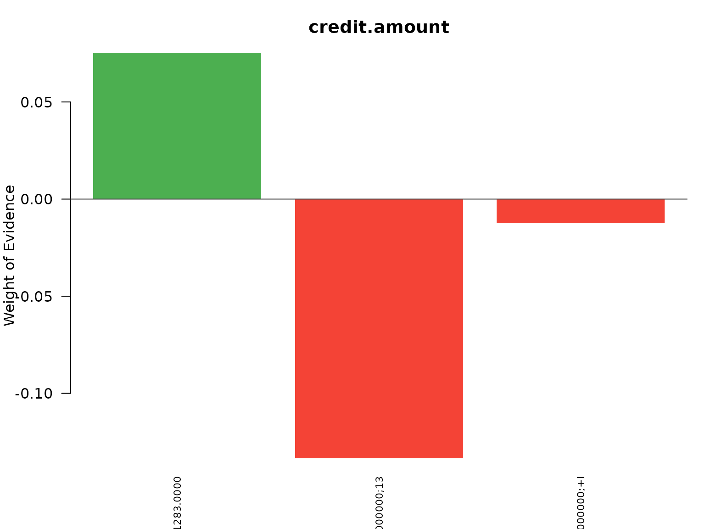
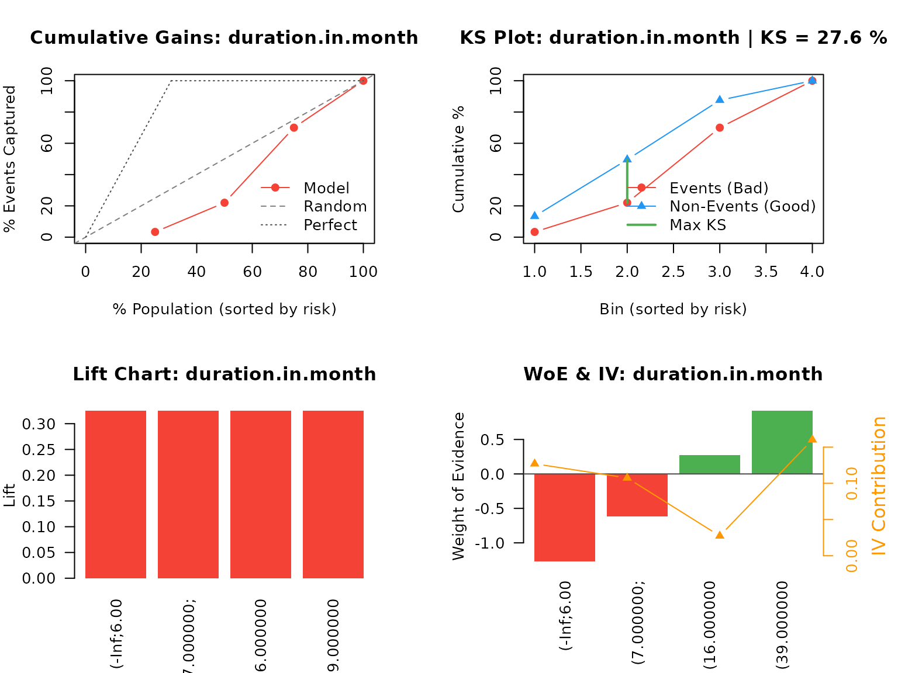
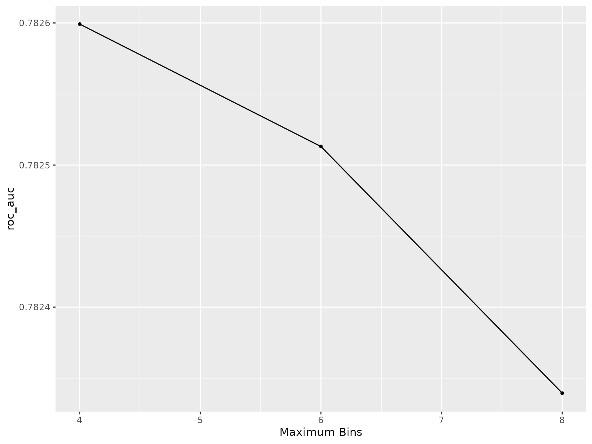

# OptimalBinningWoE: Practical Guide for Credit Risk Modeling

## Introduction

**OptimalBinningWoE** implements 36 high-performance binning algorithms
for Weight of Evidence (WoE) transformation in credit scoring and risk
modeling. This vignette demonstrates practical applications using
real-world credit data.

### Package Overview

The package provides:

- **36 algorithms**: 20 numerical + 16 categorical methods
- **C++ performance**: Fast processing of large datasets
- **tidymodels integration**: Production-ready ML pipelines
- **Regulatory compliance**: Monotonic binning for Basel/IFRS 9
- **Comprehensive metrics**: IV, KS, Gini, lift curves

### Theoretical Foundation

#### Weight of Evidence (WoE)

For bin $i$, WoE quantifies the logarithmic odds ratio:

$$\text{WoE}_{i} = \ln\left( \frac{\text{Distribution of Events}_{i}}{\text{Distribution of Non-Events}_{i}} \right) = \ln\left( \frac{n_{i,1}/N_{1}}{n_{i,0}/N_{0}} \right)$$

**Interpretation**: - WoE \> 0: Higher risk than population average -
WoE \< 0: Lower risk than population average  
- WoE ≈ 0: Similar to population average

#### Information Value (IV)

IV measures total predictive power:

$$\text{IV} = \sum\limits_{i = 1}^{k}\left( \frac{n_{i,1}}{N_{1}} - \frac{n_{i,0}}{N_{0}} \right) \times \text{WoE}_{i}$$

**Benchmarks** (Siddiqi, 2006):

| IV Range    | Predictive Power | Recommendation |
|-------------|------------------|----------------|
| \< 0.02     | Unpredictive     | Exclude        |
| 0.02 - 0.10 | Weak             | Marginal       |
| 0.10 - 0.30 | Medium           | Include        |
| 0.30 - 0.50 | Strong           | Prioritize     |
| \> 0.50     | Suspicious       | Check leakage  |

## Installation

``` r
# From GitHub
devtools::install_github("evandeilton/OptimalBinningWoE")

# Install dependencies for this vignette
install.packages(c("scorecard", "tidymodels", "pROC"))
```

## Dataset: German Credit Data

``` r
library(OptimalBinningWoE)
library(scorecard)

# Load German credit dataset
data("germancredit", package = "scorecard")

# Inspect structure
dim(germancredit)
#> [1] 1000   21
str(germancredit[, 1:8])
#> 'data.frame':    1000 obs. of  8 variables:
#>  $ status.of.existing.checking.account                : Factor w/ 4 levels "... < 0 DM","0 <= ... < 200 DM",..: 1 2 4 1 1 4 4 2 4 2 ...
#>  $ duration.in.month                                  : num  6 48 12 42 24 36 24 36 12 30 ...
#>  $ credit.history                                     : Factor w/ 5 levels "no credits taken/ all credits paid back duly",..: 5 3 5 3 4 3 3 3 3 5 ...
#>  $ purpose                                            : chr  "radio/television" "radio/television" "education" "furniture/equipment" ...
#>  $ credit.amount                                      : num  1169 5951 2096 7882 4870 ...
#>  $ savings.account.and.bonds                          : Factor w/ 5 levels "... < 100 DM",..: 5 1 1 1 1 5 3 1 4 1 ...
#>  $ present.employment.since                           : Factor w/ 5 levels "unemployed","... < 1 year",..: 5 3 4 4 3 3 5 3 4 1 ...
#>  $ installment.rate.in.percentage.of.disposable.income: num  4 2 2 2 3 2 3 2 2 4 ...

# Target variable
table(germancredit$creditability)
#> 
#>  bad good 
#>  300  700
cat("\nDefault rate:", round(mean(germancredit$creditability == "bad") * 100, 2), "%\n")
#> 
#> Default rate: 30 %
```

### Data Preparation

``` r
# Create binary target (must be a factor for tidymodels classification)
german <- germancredit
german$default <- factor(
  ifelse(german$creditability == "bad", 1, 0),
  levels = c(0, 1),
  labels = c("good", "bad")
)
german$creditability <- NULL

# Select key features for demonstration
features_num <- c("duration.in.month", "credit.amount", "age.in.years")
features_cat <- c(
  "status.of.existing.checking.account", "credit.history",
  "purpose", "savings.account.and.bonds"
)

german_model <- german[c("default", features_num, features_cat)]

# Summary statistics
cat("Numerical features:\n")
#> Numerical features:
summary(german_model[, features_num])
#>  duration.in.month credit.amount    age.in.years  
#>  Min.   : 4.0      Min.   :  250   Min.   :19.00  
#>  1st Qu.:12.0      1st Qu.: 1366   1st Qu.:27.00  
#>  Median :18.0      Median : 2320   Median :33.00  
#>  Mean   :20.9      Mean   : 3271   Mean   :35.55  
#>  3rd Qu.:24.0      3rd Qu.: 3972   3rd Qu.:42.00  
#>  Max.   :72.0      Max.   :18424   Max.   :75.00

cat("\n\nCategorical features:\n")
#> 
#> 
#> Categorical features:
sapply(german_model[, features_cat], function(x) length(unique(x)))
#> status.of.existing.checking.account                      credit.history 
#>                                   4                                   5 
#>                             purpose           savings.account.and.bonds 
#>                                  10                                   5
```

## Quick Start: Single Feature Binning

``` r
# Bin credit amount with JEDI algorithm
result_single <- obwoe(
  data = german_model,
  target = "default",
  feature = "credit.amount",
  algorithm = "jedi",
  min_bins = 3,
  max_bins = 6
)

# View results
print(result_single)
#> Optimal Binning Weight of Evidence
#> ===================================
#> 
#> Target: default ( binary )
#> Features processed: 1 
#> 
#> Results:  1  successful
#> 
#> Top features by IV:
#>   credit.amount: IV = 0.0023 (3 bins, jedi)

# Detailed binning table
result_single$results$credit.amount
#> $id
#> [1] 1 2 3
#> 
#> $bin
#> [1] "(-Inf;1283.000000]"        "(1283.000000;1393.000000]"
#> [3] "(1393.000000;+Inf]"       
#> 
#> $woe
#> [1]  0.07525674 -0.13353139 -0.01237398
#> 
#> $iv
#> [1] 0.0012184424 0.0009537957 0.0001119550
#> 
#> $count
#> [1] 212  55 733
#> 
#> $count_pos
#> [1]  67  15 218
#> 
#> $count_neg
#> [1] 145  40 515
#> 
#> $cutpoints
#> [1] 1283 1393
#> 
#> $converged
#> [1] TRUE
#> 
#> $iterations
#> [1] 2
#> 
#> $feature
#> [1] "credit.amount"
#> 
#> $type
#> [1] "numerical"
#> 
#> $algorithm
#> [1] "jedi"
```

### Visualize Binning Results

``` r
# WoE pattern visualization
plot(result_single, type = "woe")
```



### Key Insights from Single Feature

``` r
# Extract metrics
bins <- result_single$results$credit.amount

cat("Binning Summary:\n")
#> Binning Summary:
cat("  Number of bins:", nrow(bins), "\n")
#>   Number of bins:
cat("  Total IV:", round(sum(bins$iv), 4), "\n")
#>   Total IV: 0.0023
cat("  Monotonic:", all(diff(bins$woe) >= 0) || all(diff(bins$woe) <= 0), "\n\n")
#>   Monotonic: FALSE

# Event rates by bin
bins_summary <- data.frame(
  Bin = bins$bin,
  Count = bins$count,
  Event_Rate = round(bins$count_pos / bins$count * 100, 2),
  WoE = round(bins$woe, 4),
  IV_Contribution = round(bins$iv, 4)
)

print(bins_summary)
#>                         Bin Count Event_Rate     WoE IV_Contribution
#> 1        (-Inf;1283.000000]   212      31.60  0.0753          0.0012
#> 2 (1283.000000;1393.000000]    55      27.27 -0.1335          0.0010
#> 3        (1393.000000;+Inf]   733      29.74 -0.0124          0.0001
```

## Multiple Features: Automated Binning

``` r
# Bin all features simultaneously
result_multi <- obwoe(
  data = german_model,
  target = "default",
  algorithm = "cm",
  min_bins = 3,
  max_bins = 4
)

# Summary of all features
summary(result_multi)
#> Summary: Optimal Binning Weight of Evidence
#> ============================================
#> 
#> Target: default ( binary )
#> 
#> Aggregate Statistics:
#>   Features: 7 total, 7 successful, 0 errors
#>   Total IV: 1.5179
#>   Mean IV: 0.2168 (SD: 0.2231)
#>   Median IV: 0.1897
#>   IV Range: [0.0018, 0.6624]
#>   Mean Bins: 3.6
#> 
#> IV Classification (Siddiqi, 2006):
#>   Unpredictive: 2 features
#>   Medium      : 4 features
#>   Suspicious  : 1 features
#> 
#> Feature Details:
#>                              feature        type n_bins    total_iv
#>  status.of.existing.checking.account categorical      4 0.662430485
#>                       credit.history categorical      4 0.289999923
#>                    duration.in.month   numerical      4 0.206606852
#>            savings.account.and.bonds categorical      3 0.189741384
#>                              purpose categorical      4 0.161473063
#>                        credit.amount   numerical      3 0.005917450
#>                         age.in.years   numerical      3 0.001775917
#>      iv_class
#>    Suspicious
#>        Medium
#>        Medium
#>        Medium
#>        Medium
#>  Unpredictive
#>  Unpredictive
```

### Feature Selection by IV

``` r
# Extract IV summary
iv_summary <- result_multi$summary[!result_multi$summary$error, ]
iv_summary <- iv_summary[order(-iv_summary$total_iv), ]

# Top predictive features
cat("Top 5 Features by Information Value:\n\n")
#> Top 5 Features by Information Value:
print(head(iv_summary[, c("feature", "total_iv", "n_bins")], 5))
#>                               feature  total_iv n_bins
#> 4 status.of.existing.checking.account 0.6624305      4
#> 5                      credit.history 0.2899999      4
#> 1                   duration.in.month 0.2066069      4
#> 7           savings.account.and.bonds 0.1897414      3
#> 6                             purpose 0.1614731      4

# Select features with IV >= 0.02
strong_features <- iv_summary$feature[iv_summary$total_iv >= 0.02]
cat("\n\nFeatures with IV >= 0.02:", length(strong_features), "\n")
#> 
#> 
#> Features with IV >= 0.02: 5
```

### Gains Table Analysis

``` r
# Compute gains for best numerical feature
best_num_feature <- iv_summary$feature[
  iv_summary$feature %in% features_num
][1]

gains <- obwoe_gains(result_multi, feature = best_num_feature, sort_by = "id")

print(gains)
#> Gains Table: duration.in.month 
#> ================================================== 
#> 
#> Observations: 487  |  Bins: 4
#> Total IV: 0.4220
#> 
#> Performance Metrics:
#>   KS Statistic: 27.55%
#>   Gini Coefficient: 34.25%
#>   AUC: 0.3287
#> 
#>                    bin count pos_rate     woe     iv cum_pos_pct    ks lift
#>        (-Inf;6.000000]    50   10.00% -1.2676 0.1270        3.3% 10.0% 0.32
#>   (7.000000;15.000000]   150   18.67% -0.6128 0.1075       22.0% 27.6% 0.32
#>  (16.000000;36.000000]   200   36.00%  0.2731 0.0274       70.0% 17.5% 0.32
#>       (39.000000;+Inf]    87   51.72%  0.9136 0.1602      100.0%  0.0% 0.32

# Plot gains curves
oldpar <- par(mfrow = c(2, 2))
plot(gains, type = "cumulative")
plot(gains, type = "ks")
plot(gains, type = "lift")
plot(gains, type = "woe_iv")
```



``` r
par(oldpar)
```

## Algorithm Comparison

Different algorithms excel in different scenarios. Let’s compare
performance.

``` r
# Test multiple algorithms on credit.amount
algorithms <- c("jedi", "mdlp", "mob", "ewb", "cm")

compare_algos <- function(data, target, feature, algos) {
  results <- lapply(algos, function(algo) {
    tryCatch(
      {
        fit <- obwoe(
          data = data,
          target = target,
          feature = feature,
          algorithm = algo,
          min_bins = 3,
          max_bins = 6
        )

        data.frame(
          Algorithm = algo,
          N_Bins = fit$summary$n_bins[1],
          IV = round(fit$summary$total_iv[1], 4),
          Converged = fit$summary$converged[1],
          stringsAsFactors = FALSE
        )
      },
      error = function(e) {
        # Return NA but log error for debugging during vignette rendering
        message(sprintf("Algorithm '%s' failed: %s", algo, e$message))
        data.frame(
          Algorithm = algo,
          N_Bins = NA_integer_,
          IV = NA_real_,
          Converged = FALSE,
          stringsAsFactors = FALSE
        )
      }
    )
  })

  do.call(rbind, results)
}

# Compare on credit.amount
comp_result <- compare_algos(
  german_model,
  "default",
  "credit.amount",
  algorithms
)

cat("Algorithm Comparison on 'credit.amount':\n\n")
#> Algorithm Comparison on 'credit.amount':
print(comp_result[order(-comp_result$IV), ])
#>   Algorithm N_Bins     IV Converged
#> 3       mob      5 0.0917      TRUE
#> 4       ewb      3 0.0735      TRUE
#> 5        cm      3 0.0617      TRUE
#> 2      mdlp      3 0.0107      TRUE
#> 1      jedi      3 0.0023      TRUE
```

### Algorithm Selection Guide

``` r
# View algorithm capabilities
algo_info <- obwoe_algorithms()

cat("Algorithm Categories:\n\n")
#> Algorithm Categories:

cat("Fast for Large Data (O(n) complexity):\n")
#> Fast for Large Data (O(n) complexity):
print(algo_info[
  algo_info$algorithm %in% c("ewb", "sketch"),
  c("algorithm", "numerical", "categorical")
])
#>    algorithm numerical categorical
#> 8     sketch      TRUE        TRUE
#> 18       ewb      TRUE       FALSE

cat("\n\nRegulatory Compliant (Monotonic):\n")
#> 
#> 
#> Regulatory Compliant (Monotonic):
print(algo_info[
  algo_info$algorithm %in% c("mob", "mblp", "ir"),
  c("algorithm", "numerical", "categorical")
])
#>    algorithm numerical categorical
#> 7        mob      TRUE        TRUE
#> 20        ir      TRUE       FALSE
#> 24      mblp      TRUE       FALSE

cat("\n\nGeneral Purpose (algorithm):\n")
#> 
#> 
#> General Purpose (algorithm):
print(algo_info[
  algo_info$name %in% c("jedi", "cm", "mdlp"),
  c("algorithm", "numerical", "categorical")
])
#> [1] algorithm   numerical   categorical
#> <0 rows> (or 0-length row.names)
```

### Algorithm Selection by Use Case

| Use Case                       | Recommended Algorithm | Rationale                                                            |
|--------------------------------|-----------------------|----------------------------------------------------------------------|
| **General credit scoring**     | `jedi`, `mob`         | Best balance of speed and predictive power.                          |
| **Monotonicity mandatory**     | `mob`, `mblp`, `ir`   | Guaranteed monotonic WoE profile for regulatory compliance.          |
| **Large datasets (\>1M rows)** | `sketch`, `ewb`       | Constant or sublinear memory footprint.                              |
| **Non-linear associations**    | `dp`, `cm`            | Optimal partitioning (Dynamic Programming) capturing complex trends. |
| **Mixed data types**           | `jedi_mwoe`, `udt`    | Handles both numerical and categorical features uniformly.           |
| **Outlier robustness**         | `mdlp`, `fetb`        | Entropy-based discretization less sensitive to extreme values.       |
| **Sparse categorical data**    | `gmb`, `ivb`, `swb`   | Groups infrequent categories based on similar risk profiles.         |

#### Complete Algorithm List (36 Algorithms)

| Type                 | Algorithms                                                                                    |
|----------------------|-----------------------------------------------------------------------------------------------|
| **Universal (9)**    | `jedi`, `jedi_mwoe`, `cm`, `dp`, `dmiv`, `fetb`, `mob`, `sketch`, `udt`                       |
| **Numerical (12)**   | `bb`, `ewb`, `fast_mdlp`, `ir`, `kmb`, `ldb`, `lpdb`, `mblp`, `mdlp`, `mrblp`, `oslp`, `ubsd` |
| **Categorical (15)** | `gmb`, `ivb`, `mba`, `milp`, `sab`, `sblp`, `swb` (and others)                                |

*Full mapping can be inspected via
[`obwoe_algorithms()`](https://evandeilton.github.io/OptimalBinningWoE/reference/obwoe_algorithms.md).*

## Production Pipeline with tidymodels

The most powerful application is integrating WoE into production ML
workflows.

``` r
library(tidymodels)

# Train/test split with stratification
set.seed(123)
german_split <- initial_split(german_model, prop = 0.7, strata = default)
train_data <- training(german_split)
test_data <- testing(german_split)

cat("Training set:", nrow(train_data), "observations\n")
#> Training set: 699 observations
cat("Test set:", nrow(test_data), "observations\n")
#> Test set: 301 observations
cat("Train default rate:", round(mean(train_data$default == "bad") * 100, 2), "%\n")
#> Train default rate: 30.04 %
```

### Define Preprocessing Recipe

``` r
# Create recipe with WoE transformation
rec_woe <- recipe(default ~ ., data = train_data) %>%
  step_obwoe(
    all_predictors(),
    outcome = "default",
    algorithm = "jedi",
    min_bins = 2,
    max_bins = tune(), # Hyperparameter tuning
    bin_cutoff = 0.05,
    output = "woe"
  )

# Preview recipe
rec_woe
#> Optimal Binning WoE (all_predictors()) [algorithm='jedi']
```

### Model Specification and Workflow

``` r
# Logistic regression specification
lr_spec <- logistic_reg() %>%
  set_engine("glm") %>%
  set_mode("classification")

# Create complete workflow
wf_credit <- workflow() %>%
  add_recipe(rec_woe) %>%
  add_model(lr_spec)

wf_credit
#> ══ Workflow ════════════════════════════════════════════════════════════════════
#> Preprocessor: Recipe
#> Model: logistic_reg()
#> 
#> ── Preprocessor ────────────────────────────────────────────────────────────────
#> 1 Recipe Step
#> 
#> • step_obwoe()
#> 
#> ── Model ───────────────────────────────────────────────────────────────────────
#> Logistic Regression Model Specification (classification)
#> 
#> Computational engine: glm
```

### Hyperparameter Tuning

``` r
# Define tuning grid
tune_grid <- tibble(max_bins = c(4, 6, 8))

# Create cross-validation folds
set.seed(456)
cv_folds <- vfold_cv(train_data, v = 5, strata = default)

# Tune workflow
tune_results <- tune_grid(
  wf_credit,
  resamples = cv_folds,
  grid = tune_grid,
  metrics = metric_set(roc_auc, accuracy)
)

# Best configuration
collect_metrics(tune_results) %>%
  # filter(.metric == "roc_auc") %>%
  arrange(desc(mean))
#> # A tibble: 6 × 7
#>   max_bins .metric  .estimator  mean     n std_err .config        
#>      <dbl> <chr>    <chr>      <dbl> <int>   <dbl> <chr>          
#> 1        4 roc_auc  binary     0.783     5 0.0168  pre1_mod0_post0
#> 2        6 roc_auc  binary     0.783     5 0.0176  pre2_mod0_post0
#> 3        8 roc_auc  binary     0.782     5 0.0177  pre3_mod0_post0
#> 4        6 accuracy binary     0.752     5 0.00955 pre2_mod0_post0
#> 5        8 accuracy binary     0.751     5 0.00974 pre3_mod0_post0
#> 6        4 accuracy binary     0.745     5 0.00854 pre1_mod0_post0

# Visualize tuning
autoplot(tune_results, metric = "roc_auc")
```



### Final Model Fitting

``` r
# Select best parameters
best_params <- select_best(tune_results, metric = "roc_auc")
cat("Optimal max_bins:", best_params$max_bins, "\n\n")
#> Optimal max_bins: 4

# Finalize and fit
final_wf <- finalize_workflow(wf_credit, best_params)
final_fit <- fit(final_wf, data = train_data)

# Extract coefficients
final_fit %>%
  extract_fit_parsnip() %>%
  tidy() %>%
  arrange(desc(abs(estimate)))
#> # A tibble: 8 × 5
#>   term                                estimate std.error statistic  p.value
#>   <chr>                                  <dbl>     <dbl>     <dbl>    <dbl>
#> 1 purpose                                1.00      0.233      4.29 1.76e- 5
#> 2 savings.account.and.bonds              0.911     0.236      3.86 1.12e- 4
#> 3 (Intercept)                           -0.830     0.100     -8.29 1.13e-16
#> 4 age.in.years                           0.824     0.289      2.85 4.36e- 3
#> 5 status.of.existing.checking.account    0.811     0.117      6.93 4.22e-12
#> 6 credit.history                         0.748     0.167      4.48 7.63e- 6
#> 7 credit.amount                          0.726     0.312      2.33 1.99e- 2
#> 8 duration.in.month                      0.704     0.200      3.51 4.42e- 4
```

### Model Evaluation

``` r
# Predictions on test set
test_pred <- augment(final_fit, test_data)

# Performance metrics
metrics <- metric_set(roc_auc, accuracy, sens, spec, precision)
metrics(test_pred,
  truth = default, estimate = .pred_class,
  .pred_bad, event_level = "second"
)
#> # A tibble: 5 × 3
#>   .metric   .estimator .estimate
#>   <chr>     <chr>          <dbl>
#> 1 accuracy  binary         0.681
#> 2 sens      binary         0.344
#> 3 spec      binary         0.825
#> 4 precision binary         0.456
#> 5 roc_auc   binary         0.732

# ROC curve
roc_curve(test_pred,
  truth = default, .pred_bad,
  event_level = "second"
) %>%
  autoplot() +
  labs(title = "ROC Curve - German Credit Model")
```


### Inspect Learned Binning Rules

``` r
# Extract trained recipe
trained_rec <- extract_recipe(final_fit)
woe_step <- trained_rec$steps[[1]]

# View binning for credit.amount
credit_bins <- woe_step$binning_results$credit.amount

data.frame(
  Bin = credit_bins$bin,
  WoE = round(credit_bins$woe, 4),
  IV = round(credit_bins$iv, 4)
)
#>                         Bin     WoE     IV
#> 1         (-Inf;700.000000] -0.2156 0.0022
#> 2  (700.000000;3249.000000] -0.2041 0.0244
#> 3 (3249.000000;5954.000000]  0.0396 0.0003
#> 4        (5954.000000;+Inf]  0.7652 0.0935
```

## Traditional Scorecard Development

For traditional credit scorecards outside tidymodels.

### Train-Test Split

``` r
set.seed(789)
n_total <- nrow(german_model)
train_idx <- sample(1:n_total, size = 0.7 * n_total)

train_sc <- german_model[train_idx, ]
test_sc <- german_model[-train_idx, ]
```

### Fit Optimal Binning

``` r
# Use monotonic binning for regulatory compliance
sc_binning <- obwoe(
  data = train_sc,
  target = "default",
  algorithm = "mob", # Monotonic Optimal Binning
  min_bins = 3,
  max_bins = 5,
  control = control.obwoe(
    bin_cutoff = 0.05,
    convergence_threshold = 1e-6
  )
)

summary(sc_binning)
#> Summary: Optimal Binning Weight of Evidence
#> ============================================
#> 
#> Target: default ( binary )
#> 
#> Aggregate Statistics:
#>   Features: 7 total, 7 successful, 0 errors
#>   Total IV: 1.8858
#>   Mean IV: 0.2694 (SD: 0.3355)
#>   Median IV: 0.1432
#>   IV Range: [0.0005, 0.9570]
#>   Mean Bins: 3.7
#> 
#> IV Classification (Siddiqi, 2006):
#>   Unpredictive: 2 features
#>   Weak        : 1 features
#>   Medium      : 2 features
#>   Strong      : 1 features
#>   Suspicious  : 1 features
#> 
#> Feature Details:
#>                              feature        type n_bins    total_iv
#>  status.of.existing.checking.account categorical      4 0.956958967
#>            savings.account.and.bonds categorical      5 0.411933550
#>                       credit.history categorical      5 0.260486195
#>                    duration.in.month   numerical      3 0.143223080
#>                              purpose categorical      3 0.095403913
#>                         age.in.years   numerical      3 0.017231668
#>                        credit.amount   numerical      3 0.000523977
#>      iv_class
#>    Suspicious
#>        Strong
#>        Medium
#>        Medium
#>          Weak
#>  Unpredictive
#>  Unpredictive
```

### Apply WoE Transformation

``` r
# Transform training data with error handling
train_woe <- tryCatch(
  {
    obwoe_apply(train_sc, sc_binning, keep_original = FALSE)
  },
  error = function(e) {
    message("Error in obwoe_apply for training data: ", e$message)
    message("This may occur with certain data distributions. Skipping transformation.")
    return(NULL)
  }
)

# Only proceed if transformation succeeded
if (!is.null(train_woe)) {
  # Transform test data (uses training bins)
  test_woe <- obwoe_apply(test_sc, sc_binning, keep_original = FALSE)

  # Preview transformed features
  head(train_woe[, c("default", grep("_woe$", names(train_woe), value = TRUE)[1:3])], 10)
} else {
  message("Skipping WoE transformation demonstration due to data incompatibility.")
}
#>    default duration.in.month_woe credit.amount_woe age.in.years_woe
#> 1      bad             0.1024181      -0.002787588      -0.04548908
#> 2     good             0.1024181      -0.002787588      -0.04548908
#> 3     good             0.1024181       0.054981244      -0.04548908
#> 4     good             0.1024181      -0.002787588      -0.04548908
#> 5     good             0.1024181      -0.002787588      -0.04548908
#> 6     good             0.1024181      -0.002787588      -0.04548908
#> 7     good             0.1024181      -0.002787588       0.31220411
#> 8     good             0.1024181       0.054981244      -0.04548908
#> 9     good             0.1024181      -0.002787588      -0.04548908
#> 10    good             0.1024181      -0.002787588      -0.04548908
```

### Build Logistic Regression

``` r
if (!is.null(train_woe)) {
  # Select features with IV >= 0.02
  selected <- sc_binning$summary$feature[
    sc_binning$summary$total_iv >= 0.02 &
      !sc_binning$summary$error
  ]

  woe_vars <- paste0(selected, "_woe")
  formula_str <- paste("default ~", paste(woe_vars, collapse = " + "))

  # Fit model
  scorecard_glm <- glm(
    as.formula(formula_str),
    data = train_woe,
    family = binomial(link = "logit")
  )

  summary(scorecard_glm)
} else {
  message("Skipping model building - WoE transformation failed.")
}
#> 
#> Call:
#> glm(formula = as.formula(formula_str), family = binomial(link = "logit"), 
#>     data = train_woe)
#> 
#> Coefficients:
#>                                         Estimate Std. Error z value Pr(>|z|)
#> (Intercept)                             -0.79374    0.09883  -8.031 9.65e-16
#> duration.in.month_woe                    0.72740    0.23363   3.114 0.001849
#> status.of.existing.checking.account_woe  0.89237    0.10413   8.570  < 2e-16
#> credit.history_woe                       0.74937    0.19002   3.944 8.03e-05
#> purpose_woe                              1.02008    0.30818   3.310 0.000933
#> savings.account.and.bonds_woe            0.75047    0.19641   3.821 0.000133
#>                                            
#> (Intercept)                             ***
#> duration.in.month_woe                   ** 
#> status.of.existing.checking.account_woe ***
#> credit.history_woe                      ***
#> purpose_woe                             ***
#> savings.account.and.bonds_woe           ***
#> ---
#> Signif. codes:  0 '***' 0.001 '**' 0.01 '*' 0.05 '.' 0.1 ' ' 1
#> 
#> (Dispersion parameter for binomial family taken to be 1)
#> 
#>     Null deviance: 860.23  on 699  degrees of freedom
#> Residual deviance: 665.59  on 694  degrees of freedom
#> AIC: 677.59
#> 
#> Number of Fisher Scoring iterations: 5
```

### Scorecard Validation

``` r
if (!is.null(train_woe) && exists("scorecard_glm")) {
  library(pROC)

  # Predictions
  test_woe$score <- predict(scorecard_glm, newdata = test_woe, type = "response")

  # ROC curve
  roc_obj <- roc(test_woe$default, test_woe$score, quiet = TRUE)
  auc_val <- auc(roc_obj)

  # KS statistic
  ks_stat <- max(abs(
    ecdf(test_woe$score[test_woe$default == "bad"])(seq(0, 1, 0.01)) -
      ecdf(test_woe$score[test_woe$default == "good"])(seq(0, 1, 0.01))
  ))

  # Gini coefficient
  gini <- 2 * auc_val - 1

  cat("Scorecard Performance:\n")
  cat("  AUC:  ", round(auc_val, 4), "\n")
  cat("  Gini: ", round(gini, 4), "\n")
  cat("  KS:   ", round(ks_stat * 100, 2), "%\n")

  # ROC plot
  plot(roc_obj,
    main = "Scorecard ROC Curve",
    print.auc = TRUE, print.thres = "best"
  )
} else {
  message("Skipping validation - model not available.")
}
#> Scorecard Performance:
#>   AUC:   0.6504 
#>   Gini:  0.3007 
#>   KS:    29.93 %
```


## Data Preprocessing

Proper preprocessing improves binning quality.

### Handling Missing Values and Outliers

``` r
# Simulate feature with issues
set.seed(2024)
problematic <- c(
  rnorm(800, 5000, 2000), # Normal values
  rep(NA, 100), # Missing
  runif(100, -10000, 50000) # Outliers
)

target_sim <- rbinom(1000, 1, 0.3)

# Preprocess with IQR method
preproc_result <- ob_preprocess(
  feature = problematic,
  target = target_sim,
  outlier_method = "iqr",
  outlier_process = TRUE,
  preprocess = "both"
)

# View report
print(preproc_result$report)
#>   variable_type missing_count outlier_count
#> 1       numeric           100            73
#>                                                                                                       original_stats
#> 1 { min: -8995.151324, Q1: 3697.784305, median: 5113.928039, mean: 6625.179803, Q3: 6705.149551, max: 49477.654407 }
#>                                                                                                   preprocessed_stats
#> 1 { min: -2161.216958, Q1: 3042.732437, median: 4792.608602, mean: 4703.116058, Q3: 6517.601547, max: 11703.913644 }

# Compare distributions
cat("\n\nBefore preprocessing:\n")
#> 
#> 
#> Before preprocessing:
cat("  Range:", range(problematic, na.rm = TRUE), "\n")
#>   Range: -2161.217 11703.91
cat("  Missing:", sum(is.na(problematic)), "\n")
#>   Missing: 0
cat("  Mean:", round(mean(problematic, na.rm = TRUE), 2), "\n")
#>   Mean: 4703.12

cat("\nAfter preprocessing:\n")
#> 
#> After preprocessing:
cleaned <- preproc_result$preprocess$feature_preprocessed
cat("  Range:", range(cleaned), "\n")
#>   Range: -2161.217 11703.91
cat("  Missing:", sum(is.na(cleaned)), "\n")
#>   Missing: 0
cat("  Mean:", round(mean(cleaned), 2), "\n")
#>   Mean: 4703.12
```

## Production Deployment

### Model Serialization

``` r
# Add metadata to model
sc_binning$metadata <- list(
  creation_date = Sys.time(),
  creator = Sys.info()["user"],
  dataset_size = nrow(train_sc),
  default_rate = mean(train_sc$default == "bad"),
  r_version = R.version.string,
  package_version = packageVersion("OptimalBinningWoE")
)

# Save model
saveRDS(sc_binning, "credit_scorecard_v1_20250101.rds")

# Load model
loaded_model <- readRDS("credit_scorecard_v1_20250101.rds")
```

### Production Scoring Function

``` r
score_applications <- function(new_data, model_file) {
  # Load binning model
  binning_model <- readRDS(model_file)

  # Validate required features
  required_vars <- binning_model$summary$feature[
    !binning_model$summary$error
  ]

  missing_vars <- setdiff(required_vars, names(new_data))
  if (length(missing_vars) > 0) {
    stop("Missing features: ", paste(missing_vars, collapse = ", "))
  }

  # Apply WoE transformation
  scored <- obwoe_apply(new_data, binning_model, keep_original = TRUE)

  # Add timestamp
  scored$scoring_date <- Sys.Date()

  return(scored)
}

# Usage example
# new_apps <- read.csv("new_applications.csv")
# scored_apps <- score_applications(new_apps, "credit_scorecard_v1_20250101.rds")
```

## Best Practices Summary

### Workflow Recommendations

1.  **Start Simple**: Use `algorithm = "jedi"` as default
2.  **Check IV**: Select features with IV ≥ 0.02
3.  **Validate Monotonicity**: Use MOB/MBLP for regulatory models
4.  **Cross-Validate**: Tune binning parameters with CV
5.  **Monitor Stability**: Track WoE distributions over time
6.  **Document Thoroughly**: Save metadata with models

### Common Pitfalls to Avoid

``` r
# ❌ Don't bin on full dataset before splitting
# This causes data leakage!
bad_approach <- obwoe(full_data, target = "y")
train_woe <- obwoe_apply(train_data, bad_approach)

# ✅ Correct: Bin only on training data
good_approach <- obwoe(train_data, target = "y")
test_woe <- obwoe_apply(test_data, good_approach)

# ❌ Don't ignore IV thresholds
# IV > 0.50 likely indicates target leakage
suspicious_features <- result$summary$feature[
  result$summary$total_iv > 0.50
]

# ❌ Don't over-bin
# Too many bins (>10) reduces interpretability
# and may cause overfitting
```

## References

Siddiqi, N. (2006). *Credit Risk Scorecards: Developing and Implementing
Intelligent Credit Scoring*. John Wiley & Sons.

Thomas, L. C., Edelman, D. B., & Crook, J. N. (2002). *Credit Scoring
and Its Applications*. SIAM.

Navas-Palencia, G. (2020). Optimal Binning: Mathematical Programming
Formulation. *Expert Systems with Applications*, 158, 113508.

Anderson, R. (2007). *The Credit Scoring Toolkit: Theory and Practice
for Retail Credit Risk Management*. Oxford University Press.

## Session Information

``` r
sessionInfo()
#> R version 4.5.2 (2025-10-31)
#> Platform: x86_64-pc-linux-gnu
#> Running under: Ubuntu 24.04.3 LTS
#> 
#> Matrix products: default
#> BLAS:   /usr/lib/x86_64-linux-gnu/openblas-pthread/libblas.so.3 
#> LAPACK: /usr/lib/x86_64-linux-gnu/openblas-pthread/libopenblasp-r0.3.26.so;  LAPACK version 3.12.0
#> 
#> locale:
#>  [1] LC_CTYPE=C.UTF-8       LC_NUMERIC=C           LC_TIME=C.UTF-8       
#>  [4] LC_COLLATE=C.UTF-8     LC_MONETARY=C.UTF-8    LC_MESSAGES=C.UTF-8   
#>  [7] LC_PAPER=C.UTF-8       LC_NAME=C              LC_ADDRESS=C          
#> [10] LC_TELEPHONE=C         LC_MEASUREMENT=C.UTF-8 LC_IDENTIFICATION=C   
#> 
#> time zone: UTC
#> tzcode source: system (glibc)
#> 
#> attached base packages:
#> [1] stats     graphics  grDevices utils     datasets  methods   base     
#> 
#> other attached packages:
#>  [1] pROC_1.19.0.1           yardstick_1.3.2         workflowsets_1.1.1     
#>  [4] workflows_1.3.0         tune_2.0.1              tidyr_1.3.2            
#>  [7] tailor_0.1.0            rsample_1.3.1           recipes_1.3.1          
#> [10] purrr_1.2.1             parsnip_1.4.1           modeldata_1.5.1        
#> [13] infer_1.1.0             ggplot2_4.0.1           dplyr_1.1.4            
#> [16] dials_1.4.2             scales_1.4.0            broom_1.0.11           
#> [19] tidymodels_1.4.1        scorecard_0.4.5         OptimalBinningWoE_1.0.6
#> 
#> loaded via a namespace (and not attached):
#>  [1] gridExtra_2.3       rlang_1.1.7         magrittr_2.0.4     
#>  [4] furrr_0.3.1         compiler_4.5.2      systemfonts_1.3.1  
#>  [7] vctrs_0.7.1         lhs_1.2.0           pkgconfig_2.0.3    
#> [10] fastmap_1.2.0       backports_1.5.0     labeling_0.4.3     
#> [13] utf8_1.2.6          rmarkdown_2.30      prodlim_2025.04.28 
#> [16] ragg_1.5.0          xfun_0.56           cachem_1.1.0       
#> [19] jsonlite_2.0.0      parallel_4.5.2      R6_2.6.1           
#> [22] bslib_0.9.0         stringi_1.8.7       RColorBrewer_1.1-3 
#> [25] parallelly_1.46.1   rpart_4.1.24        lubridate_1.9.4    
#> [28] jquerylib_0.1.4     Rcpp_1.1.1          iterators_1.0.14   
#> [31] knitr_1.51          future.apply_1.20.1 Matrix_1.7-4       
#> [34] splines_4.5.2       nnet_7.3-20         timechange_0.3.0   
#> [37] tidyselect_1.2.1    rstudioapi_0.18.0   yaml_2.3.12        
#> [40] timeDate_4051.111   doParallel_1.0.17   codetools_0.2-20   
#> [43] listenv_0.10.0      lattice_0.22-7      tibble_3.3.1       
#> [46] withr_3.0.2         S7_0.2.1            evaluate_1.0.5     
#> [49] future_1.69.0       desc_1.4.3          survival_3.8-3     
#> [52] zip_2.3.3           xml2_1.5.2          pillar_1.11.1      
#> [55] foreach_1.5.2       generics_0.1.4      globals_0.18.0     
#> [58] class_7.3-23        glue_1.8.0          tools_4.5.2        
#> [61] data.table_1.18.0   openxlsx_4.2.8.1    gower_1.0.2        
#> [64] fs_1.6.6            grid_4.5.2          ipred_0.9-15       
#> [67] xefun_0.1.5         cli_3.6.5           DiceDesign_1.10    
#> [70] textshaping_1.0.4   lava_1.8.2          gtable_0.3.6       
#> [73] GPfit_1.0-9         sass_0.4.10         digest_0.6.39      
#> [76] farver_2.1.2        htmltools_0.5.9     pkgdown_2.2.0      
#> [79] lifecycle_1.0.5     hardhat_1.4.2       MASS_7.3-65        
#> [82] sparsevctrs_0.3.5
```
