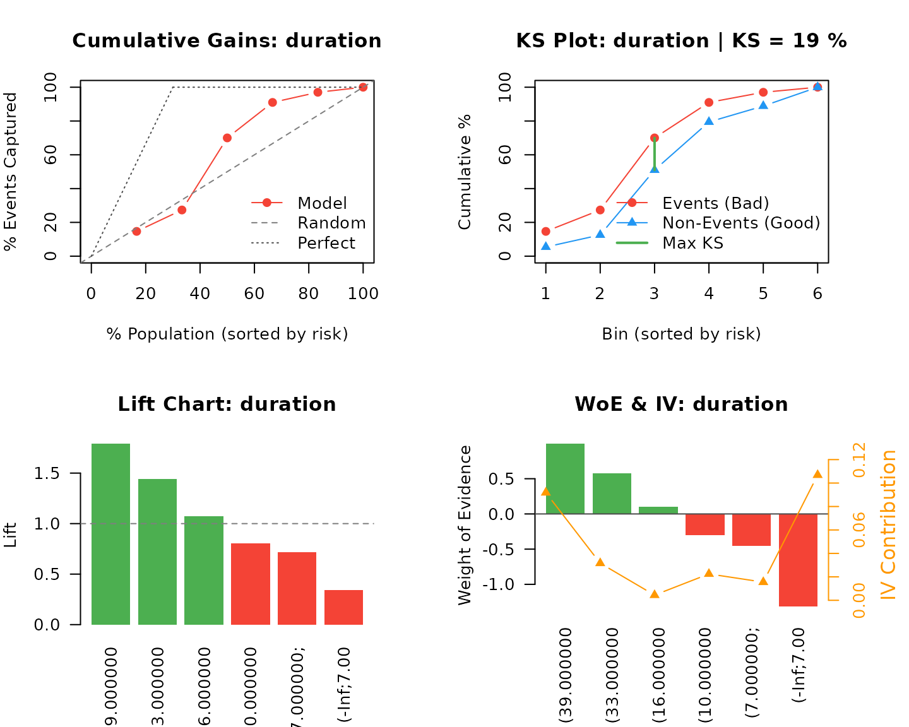

# Optimal Binning and Weight of Evidence: A Practical Guide

This vignette is the working reference for analysts who bin variables
for a living. It covers what the package computes, how to read what it
returns, and how to decide what to keep — using a benchmark dataset that
ships with the package, so every result below is reproducible with no
extra downloads.

The companion vignette, [An Industrial Scorecard
Pipeline](https://evandeilton.github.io/OptimalBinningWoE/articles/industrial-pipeline.md),
takes the same machinery to a wide production base with out-of-time
validation, a `recipes` pipeline and deployment artefacts.

``` r

library(OptimalBinningWoE)
```

## Why bin

A scorecard needs predictors that a credit committee, a regulator and a
production database can all agree on. Binning buys three things a raw
continuous variable does not give you:

- **A bounded, monotone transformation.** Outliers and skew stop
  mattering; the relationship with risk becomes a step function you can
  plot on one page.
- **Missing values as first-class citizens.** A missing income is a
  level, not an imputation problem.
- **A linear-in-the-logit predictor.** After the WoE transform, logistic
  regression coefficients are directly interpretable and the model is a
  table.

The cost is resolution: binning discards within-bin variation. The whole
craft is choosing cut points that pay for that loss.

## The quantities

### Weight of Evidence

For bin $`i`$ with $`n_{i,1}`$ events and $`n_{i,0}`$ non-events, out of
population totals $`N_1`$ and $`N_0`$:

``` math
\mathrm{WoE}_i \;=\; \ln\!\left(\frac{n_{i,1}/N_1}{n_{i,0}/N_0}\right)
\;=\; \ln \theta_i + \ln\frac{N_0}{N_1},
\qquad \theta_i = \frac{n_{i,1}}{n_{i,0}}
```

WoE is the bin log-odds shifted by a constant. Positive means riskier
than the portfolio average, negative means safer, and the scale is
comparable across variables — which is why WoE, not the raw category, is
what enters the model.

### Information Value

``` math
\mathrm{IV} \;=\; \sum_{i=1}^{k}
\left(\frac{n_{i,1}}{N_1} - \frac{n_{i,0}}{N_0}\right) \mathrm{WoE}_i
```

This is the symmetrised Kullback–Leibler divergence (Jeffreys
divergence) between the event and non-event distributions across bins.
It is the standard single-number summary of predictive strength, and the
package grades it with the bands from Siddiqi (2006):

| IV                | Band         | Reading                          |
|-------------------|--------------|----------------------------------|
| $`< 0.02`$        | Unpredictive | drop                             |
| $`[0.02,\ 0.10)`$ | Weak         | keep only if it adds diversity   |
| $`[0.10,\ 0.30)`$ | Medium       | the workhorses of a scorecard    |
| $`[0.30,\ 0.50)`$ | Strong       | strong, verify it is not a proxy |
| $`\ge 0.50`$      | Suspicious   | almost always leakage            |

IV never decreases when you split a bin, so it cannot be used on its own
to choose the number of bins — that is what the optimisation algorithms
are for.

### Monotonicity

Both quantities a scorecard cares about are strictly increasing
functions of the bin odds $`\theta_i`$:

``` math
\pi_i = \frac{n_{i,1}}{n_{i,1}+n_{i,0}} = \frac{\theta_i}{1+\theta_i},
\qquad
\mathrm{WoE}_i = \ln\theta_i + \ln\frac{N_0}{N_1}
```

So “the event rate is monotone across bins” and “the WoE is monotone
across bins” are the same statement, and checking either one suffices.
For a numerical variable this is a genuine constraint — the bin order is
the interval order. For a nominal variable it is not: the bins can
always be relabelled in WoE order, so monotonicity there is free.

## The data

The package bundles the Statlog (German Credit) benchmark: 1000 loan
applications, 7 numerical and 13 categorical attributes, from the UCI
Machine Learning Repository.

``` r

german <- read.csv(
  gzfile(system.file("extdata", "germancredit.csv.gz",
                     package = "OptimalBinningWoE")),
  stringsAsFactors = FALSE
)

# credit_risk is 1 for a good customer; the event we model is default
german$default <- 1L - german$credit_risk
german$credit_risk <- NULL

dim(german)
#> [1] 1000   21
table(german$default)
#> 
#>   0   1 
#> 700 300
```

``` r

str(german[, c("duration", "amount", "age", "purpose", "savings")])
#> 'data.frame':    1000 obs. of  5 variables:
#>  $ duration: int  6 48 12 42 24 36 24 36 12 30 ...
#>  $ amount  : int  1169 5951 2096 7882 4870 9055 2835 6948 3059 5234 ...
#>  $ age     : int  67 22 49 45 53 35 53 35 61 28 ...
#>  $ purpose : chr  "domestic appliances" "domestic appliances" "retraining" "radio/television" ...
#>  $ savings : chr  "unknown/no savings account" "... < 100 DM" "... < 100 DM" "... < 100 DM" ...
```

## One variable, end to end

[`obwoe()`](https://evandeilton.github.io/OptimalBinningWoE/reference/obwoe.md)
is the single entry point. Point it at a data frame and a target and it
detects each variable’s type, dispatches the right algorithm and returns
a fitted binning.

``` r

fit <- obwoe(german, target = "default", feature = "duration",
             min_bins = 3, max_bins = 6)
fit
#> Optimal Binning Weight of Evidence
#> ===================================
#> 
#> Target: default ( binary )
#> Features processed: 1 
#> 
#> Results:  1  successful
#> 
#> Top features by IV:
#>   duration: IV = 0.2727 (6 bins, jedi)
```

The per-variable result carries everything the transformation needs.

``` r

res <- fit$results$duration
data.frame(
  bin   = res$bin,
  count = res$count,
  pos   = res$count_pos,
  rate  = round(res$count_pos / res$count, 4),
  woe   = round(res$woe, 4),
  iv    = round(res$iv, 4)
)
#>                     bin count pos   rate     woe     iv
#> 1       (-Inf;7.000000]    87   9 0.1034 -1.3122 0.1068
#> 2  (7.000000;10.000000]    84  18 0.2143 -0.4520 0.0155
#> 3 (10.000000;16.000000]   262  63 0.2405 -0.3029 0.0225
#> 4 (16.000000;33.000000]   397 128 0.3224  0.1046 0.0044
#> 5 (33.000000;39.000000]    88  38 0.4318  0.5729 0.0316
#> 6      (39.000000;+Inf]    82  44 0.5366  0.9939 0.0918
```

Two things to read here. The event rate climbs from 10% to 54% across
the bins — longer loans default more, and the ordering never reverses.
And the IV column shows where the information sits: the two extreme bins
carry 73% of it between them, while the largest bin, holding 40% of the
portfolio, contributes almost nothing.

`cutpoints` is the authoritative boundary vector; bin labels are for
humans.

``` r

res$cutpoints
#> [1]  7 10 16 33 39
```

Intervals are half-open on the right, $`(a,\,b]`$, throughout the
package: a loan of exactly 10 months falls in the bin that ends at 10.

``` r

plot(fit, type = "woe", feature = "duration")
```


## Reading the gains table

[`obwoe_gains()`](https://evandeilton.github.io/OptimalBinningWoE/reference/obwoe_gains.md)
turns a fitted binning into the table a credit analyst actually reviews:
cumulative capture, KS, lift.

``` r

gains <- obwoe_gains(fit, feature = "duration", sort_by = "woe")
gains
#> Gains Table: duration 
#> ================================================== 
#> 
#> Observations: 1000  |  Bins: 6
#> Total IV: 0.2727
#> 
#> Performance Metrics:
#>   KS Statistic: 19.00%
#>   Gini Coefficient: 26.65%
#>   AUC: 0.6332
#> 
#>                    bin count pos_rate     woe     iv cum_pos_pct    ks lift
#>       (39.000000;+Inf]    82   53.66%  0.9939 0.0918       14.7%  9.2% 1.79
#>  (33.000000;39.000000]    88   43.18%  0.5729 0.0316       27.3% 14.8% 1.44
#>  (16.000000;33.000000]   397   32.24%  0.1046 0.0044       70.0% 19.0% 1.07
#>  (10.000000;16.000000]   262   24.05% -0.3029 0.0225       91.0% 11.6% 0.80
#>   (7.000000;10.000000]    84   21.43% -0.4520 0.0155       97.0%  8.1% 0.71
#>        (-Inf;7.000000]    87   10.34% -1.3122 0.1068      100.0%  0.0% 0.34
```

The three headline numbers:

- **KS** is the largest gap between the cumulative event and non-event
  distributions, $`\max_i |F_1(i) - F_0(i)|`$. It answers “at the best
  cut, how much better than random is this variable at separating the
  two populations”.
- **Gini** is $`2\,\mathrm{AUC}-1`$ on the binned score.
- **Lift** in a bin is its event rate over the portfolio rate — the
  operational number for a cutoff policy.

``` r

op <- par(mfrow = c(2, 2), mar = c(4, 4, 2, 1))
plot(gains, type = "cumulative")
plot(gains, type = "ks")
plot(gains, type = "lift")
plot(gains, type = "woe_iv")
```



``` r

par(op)
```

## All variables at once

Drop the `feature` argument and every column is binned. Numerical and
categorical variables are routed automatically.

``` r

model <- obwoe(german, target = "default", min_bins = 2, max_bins = 6)
model
#> Optimal Binning Weight of Evidence
#> ===================================
#> 
#> Target: default ( binary )
#> Features processed: 20 
#> 
#> Results:  20  successful
#> 
#> Top features by IV:
#>   status: IV = 0.6640 (4 bins, jedi)
#>   credit_history: IV = 0.2908 (5 bins, jedi)
#>   duration: IV = 0.2727 (6 bins, jedi)
#>   savings: IV = 0.1946 (5 bins, jedi)
#>   purpose: IV = 0.1667 (6 bins, jedi)
#>   ... and 15 more
```

``` r

summary(model)
#> Summary: Optimal Binning Weight of Evidence
#> ============================================
#> 
#> Target: default ( binary )
#> 
#> Aggregate Statistics:
#>   Features: 20 total, 20 successful, 0 errors
#>   Total IV: 2.1900
#>   Mean IV: 0.1095 (SD: 0.1572)
#>   Median IV: 0.0509
#>   IV Range: [0.0000, 0.6640]
#>   Mean Bins: 3.6
#> 
#> IV Classification (Siddiqi, 2006):
#>   Unpredictive: 6 features
#>   Weak        : 8 features
#>   Medium      : 5 features
#>   Suspicious  : 1 features
#> 
#> Feature Details:
#>                  feature        type n_bins  total_iv     iv_class
#>                   status categorical      4 6.640e-01   Suspicious
#>           credit_history categorical      5 2.908e-01       Medium
#>                 duration   numerical      6 2.727e-01       Medium
#>                  savings categorical      5 1.946e-01       Medium
#>                  purpose categorical      6 1.667e-01       Medium
#>                 property categorical      4 1.122e-01       Medium
#>                      age   numerical      5 8.868e-02         Weak
#>      employment_duration categorical      5 8.606e-02         Weak
#>                  housing categorical      3 8.298e-02         Weak
#>  other_installment_plans categorical      3 5.731e-02         Weak
#>      personal_status_sex categorical      4 4.447e-02         Weak
#>           foreign_worker categorical      2 4.294e-02         Weak
#>            other_debtors categorical      3 3.162e-02         Weak
#>         installment_rate   numerical      4 2.632e-02         Weak
#>           number_credits   numerical      2 1.008e-02 Unpredictive
#>                      job categorical      4 8.724e-03 Unpredictive
#>                telephone categorical      2 6.364e-03 Unpredictive
#>        present_residence   numerical      2 1.841e-03 Unpredictive
#>                   amount   numerical      2 1.552e-03 Unpredictive
#>            people_liable   numerical      2 4.339e-05 Unpredictive
```

### Screening with `obwoe_select()`

[`summary()`](https://rdrr.io/r/base/summary.html) ranks;
[`obwoe_select()`](https://evandeilton.github.io/OptimalBinningWoE/reference/obwoe_select.md)
decides. It applies the two criteria that govern admission in practice —
IV strength and guaranteed ordering — and returns a verdict per
variable, with the reason attached.

``` r

sel <- obwoe_select(model)
head(sel[, c("feature", "type", "n_bins", "total_iv", "iv_class",
             "ks", "gini", "monotonic", "quality", "selected")], 10)
#>                     feature        type n_bins total_iv iv_class      ks    gini monotonic
#>                      <char>      <char>  <int>    <num>   <fctr>   <num>   <num>    <lgcl>
#>  1:          credit_history categorical      5  0.29323   Medium 0.18048 0.25361      TRUE
#>  2:                duration   numerical      6  0.27274   Medium 0.19000 0.26647      TRUE
#>  3:                 savings categorical      5  0.19601   Medium 0.18667 0.19826     FALSE
#>  4:                 purpose categorical      6  0.16760   Medium 0.17905 0.22114      TRUE
#>  5:                property categorical      4  0.11264   Medium 0.11714 0.17066      TRUE
#>  6:                     age   numerical      5  0.08868     Weak 0.13143 0.16225      TRUE
#>  7:     employment_duration categorical      5  0.08643     Weak 0.11952 0.16164      TRUE
#>  8:                 housing categorical      3  0.08329     Weak 0.13286 0.13436      TRUE
#>  9: other_installment_plans categorical      3  0.05761     Weak 0.09619 0.09637      TRUE
#> 10:     personal_status_sex categorical      4  0.04467     Weak 0.10000 0.10485      TRUE
#>       quality selected
#>        <fctr>   <lgcl>
#>  1:      Good     TRUE
#>  2: Excellent     TRUE
#>  3:      Fair     TRUE
#>  4: Excellent     TRUE
#>  5: Excellent     TRUE
#>  6:      Fair     TRUE
#>  7:      Fair     TRUE
#>  8:      Fair     TRUE
#>  9:      Fair     TRUE
#> 10:      Fair     TRUE
```

Nothing is ever dropped from the output. A base with 500 candidates
returns 500 rows, so the automatic verdict can be reviewed rather than
trusted.

``` r

sel[!sel$selected, c("feature", "total_iv", "iv_class", "reason")]
#>              feature  total_iv     iv_class        reason
#>               <char>     <num>       <fctr>        <char>
#> 1:            status 6.660e-01   Suspicious IV_SUSPICIOUS
#> 2:    number_credits 1.008e-02 Unpredictive  IV_BELOW_MIN
#> 3:               job 8.763e-03 Unpredictive  IV_BELOW_MIN
#> 4:         telephone 6.378e-03 Unpredictive  IV_BELOW_MIN
#> 5: present_residence 1.841e-03 Unpredictive  IV_BELOW_MIN
#> 6:            amount 1.552e-03 Unpredictive  IV_BELOW_MIN
#> 7:     people_liable 4.339e-05 Unpredictive  IV_BELOW_MIN
```

`status` — the checking-account balance — is the strongest variable in
the file and is rejected for it. An IV of 0.67 sits in the *Suspicious*
band, where single-variable strength is far more often a symptom of
target leakage than of a genuinely dominant predictor. Raise `iv_max` to
admit it deliberately:

``` r

admitted <- obwoe_select(model, iv_max = Inf)
admitted[admitted$feature == "status",
         c("feature", "total_iv", "quality", "selected", "reason")]
#>    feature total_iv   quality selected reason
#>     <char>    <num>    <fctr>   <lgcl> <char>
#> 1:  status    0.666 Excellent     TRUE     OK
```

The policy is configurable end to end. Each rule that fires is appended
to `reason`, so a variable rejected on two counts reports both.

``` r

strict <- obwoe_select(
  model,
  iv_min            = 0.02,      # drop the Unpredictive band
  iv_max            = 0.50,      # drop the Suspicious band
  require_monotonic = "numeric", # ordering is intrinsic only for numerics
  monotonicity      = "strict",  # no ties between adjacent bins
  min_bin_pct       = 0.05,      # every bin holds at least 5% of the base
  allow_degenerate  = FALSE,     # no bin without events or without non-events
  top_n             = 8,
  sort_by           = "ks"
)
table(strict$reason)
#> 
#>           IV_BELOW_MIN IV_BELOW_MIN;SMALL_BIN          IV_SUSPICIOUS                     OK 
#>                      5                      1                      1                      8 
#>              SMALL_BIN 
#>                      5
```

### The bin-level view

`detail = "full"` returns one row per variable *and* optimised bin,
joined to the complete gains table of each. This is the object to hand
to a model validation team.

``` r

detail <- obwoe_select(model, detail = "full")
dim(detail)
#> [1] 73 51

detail[detail$feature == "savings",
       c("bin", "n_categories", "count", "pos_rate", "woe", "iv", "lift")]
#>                           bin n_categories count pos_rate     woe      iv   lift
#>                        <char>        <int> <num>    <num>   <num>   <num>  <num>
#> 1:             ... >= 1000 DM            1    48   0.1250 -1.0986 0.04394 0.4167
#> 2: unknown/no savings account            1   183   0.1749 -0.7042 0.07680 0.5829
#> 3:       500 <= ... < 1000 DM            1    63   0.1746 -0.7061 0.02656 0.5820
#> 4:        100 <= ... < 500 DM            1   103   0.3301  0.1396 0.00206 1.1003
#> 5:               ... < 100 DM            1   603   0.3599  0.2714 0.04665 1.1996
```

## Choosing an algorithm

The package ships 37 algorithms: 21 numerical, 16 categorical. They
differ in what they optimise, not in what they return.

| Family | Algorithms | Optimises |
|----|----|----|
| Information-theoretic | `mdlp`, `fast_mdlp`, `dmiv`, `ivb` | entropy or IV gain per split, with an MDL stopping rule |
| Statistical merging | `cm`, `fetb`, `mob` | merges neighbours whose difference fails a $`\chi^2`$ or Fisher test |
| Shape-constrained | `ir`, `mrblp`, `mblp`, `oslp` | best fit subject to a monotonicity constraint |
| Exact optimisation | `dp`, `milp`, `sblp`, `bb` | global optimum of IV under bin-count and size constraints |
| Metaheuristic | `sab`, `gmb`, `mba` | simulated annealing, greedy or agglomerative search |
| Unsupervised | `ewb`, `kmb`, `ubsd`, `sketch` | equal width, k-means, standard deviation, streaming quantiles |

Three questions settle the choice in practice.

**Does the model face a regulator?** Then the WoE profile must be
monotone, and a shape-constrained method (`ir`, `mrblp`, `mblp`) or
`mob` earns its keep. `ir` runs the Pool Adjacent Violators algorithm
and merges the bins it pools, so the bins it returns are monotone in
their own observed event rate.

**Is the relationship expected to be non-monotone?** Utilisation and age
often are U-shaped. Use an information-theoretic method (`mdlp`, `dmiv`)
or `jedi` and let the data pick the shape.

**How large is the base?** `sketch` is designed for streaming and very
large $`n`$; the exact optimisers (`milp`, `bb`) are the most expensive
and are best kept for a shortlist.

``` r

algos <- obwoe_algorithms()
table(numerical = algos$numerical, categorical = algos$categorical)
#>          categorical
#> numerical FALSE TRUE
#>     FALSE     0    7
#>     TRUE     12    9
```

A comparison run costs a few lines. Here five methods on `amount`, a
variable with no clean monotone relationship:

``` r

compare <- function(alg) {
  f <- obwoe(german, target = "default", feature = "amount",
             algorithm = alg, min_bins = 2, max_bins = 6)
  s <- obwoe_select(f, require_monotonic = "none")
  data.frame(algorithm = alg, n_bins = s$n_bins, iv = round(s$total_iv, 4),
             ks = round(s$ks, 4), monotonic = s$monotonic)
}

do.call(rbind, lapply(c("jedi", "mdlp", "mob", "ir", "dp"), compare))
#>   algorithm n_bins     iv     ks monotonic
#> 1      jedi      2 0.0016 0.0162      TRUE
#> 2      mdlp      2 0.1056 0.1443      TRUE
#> 3       mob      2 0.0046 0.0143      TRUE
#> 4        ir      3 0.0934 0.1152      TRUE
#> 5        dp      4 0.1142 0.1443      TRUE
```

`amount` is a hard case, and the spread is the point. `mdlp` and `dp`
find a non-trivial partition worth `IV` ≈ 0.11; `jedi` and `mob` stop at
two bins and find almost nothing. `ir` lands in between at three bins:
enforcing monotonicity on a variable whose empirical rate violates it
can only be done by pooling, so the shape constraint is paid for in
resolution. Running four or five algorithms on the awkward variables and
reading this table is cheap and usually decisive.

## Applying the transformation

[`obwoe_apply()`](https://evandeilton.github.io/OptimalBinningWoE/reference/obwoe_apply.md)
scores a data frame with a fitted binning. It is the function to use on
a validation sample, on a scoring run, or on next month’s file.

``` r

scored <- obwoe_apply(german, model, keep_original = FALSE)
head(scored[, c("default", "duration_bin", "duration_woe",
                "purpose_bin", "purpose_woe")], 4)
#>   default          duration_bin duration_woe                      purpose_bin purpose_woe
#> 1       0       (-Inf;7.000000]      -1.3122              domestic appliances    -0.41020
#> 2       1      (39.000000;+Inf]       0.9939              domestic appliances    -0.41020
#> 3       0 (10.000000;16.000000]      -0.3029 furniture/equipment%;%retraining     0.58243
#> 4       0      (39.000000;+Inf]       0.9939                 radio/television     0.09435
```

Values outside the training range fall into the extreme bins; categories
never seen during training and `NA` receive `na_woe`, which defaults to
0 — the neutral value, since $`\mathrm{WoE}=0`$ means “portfolio
average”.

``` r

two <- obwoe(german, target = "default",
             feature = c("duration", "purpose"), max_bins = 6)

new_data <- data.frame(
  duration = c(4, 10, 200, NA),
  purpose  = c("car (new)", "unseen category", "education", NA)
)
obwoe_apply(new_data, two, keep_original = TRUE)
#>   duration         duration_bin duration_woe         purpose                  purpose_bin
#> 1        4      (-Inf;7.000000]      -1.3122       car (new)                    car (new)
#> 2       10 (7.000000;10.000000]      -0.4520 unseen category                         <NA>
#> 3      200     (39.000000;+Inf]       0.9939       education others%;%repairs%;%education
#> 4       NA                 <NA>       0.0000            <NA>                         <NA>
#>   purpose_woe
#> 1      0.3575
#> 2      0.0000
#> 3      0.2315
#> 4      0.0000
```

A WoE-transformed frame is exactly what a logistic regression wants:

``` r

keep <- sel$feature[sel$selected]
woe_cols <- paste0(keep, "_woe")
train <- scored[, c("default", woe_cols)]

glm_fit <- glm(default ~ ., data = train, family = binomial())
round(head(coef(summary(glm_fit)), 6), 4)
#>                    Estimate Std. Error z value Pr(>|z|)
#> (Intercept)         -0.8522     0.0802 -10.630    0.000
#> credit_history_woe   0.8408     0.1520   5.532    0.000
#> duration_woe         0.9435     0.1661   5.682    0.000
#> savings_woe          0.9785     0.1917   5.104    0.000
#> purpose_woe          1.0711     0.1993   5.373    0.000
#> property_woe         0.5125     0.2715   1.888    0.059
```

Coefficients on WoE predictors should all come out positive: a WoE of
$`+1`$ means one log-odds more risk, so a negative coefficient signals a
variable fighting the rest of the model, usually through correlation.

## Exporting to SQL

[`obwoe_sql()`](https://evandeilton.github.io/OptimalBinningWoE/reference/obwoe_sql.md)
writes the same transformation as SQL, so the scoring can run in the
warehouse instead of in R.

``` r

obwoe_sql(
  model,
  table        = "risk.applications",
  features     = c("duration", "purpose"),
  keep_columns = "application_id",
  dialect      = "postgres"
)
#> -- ---------------------------------------------------------------
#> -- Weight of Evidence transformation
#> -- Generated by OptimalBinningWoE 1.13.3
#> -- Algorithm(s): jedi
#> -- Dialect: postgres
#> -- Interval convention: (lower, upper]  -- upper bound inclusive
#> -- Variables: 2
#> --
#> -- Variable                 Type          Bins        IV
#> --   duration               numerical        6   0.27274
#> --   purpose                categorical      6   0.16671
#> -- ---------------------------------------------------------------
#> SELECT
#> application_id,
#> CASE
#>     WHEN duration IS NULL THEN 0
#>     WHEN duration <= 7 THEN -1.3121863889661687
#>     WHEN duration > 7 AND duration <= 10 THEN -0.45198512374305744
#>     WHEN duration > 10 AND duration <= 16 THEN -0.3028722379457563
#>     WHEN duration > 16 AND duration <= 33 THEN 0.10461674470498177
#>     WHEN duration > 33 AND duration <= 39 THEN 0.5728610146854435
#>     WHEN duration > 39 THEN 0.993901334579079
#>     ELSE 0
#> END AS duration_woe,
#> CASE
#>     WHEN purpose IS NULL THEN 0
#>     WHEN purpose IN ('business', 'car (used)') THEN -0.8019940993019
#>     WHEN purpose = 'domestic appliances' THEN -0.4102018501730504
#>     WHEN purpose = 'radio/television' THEN 0.09434664779110719
#>     WHEN purpose IN ('others', 'repairs', 'education') THEN 0.23148312351021103
#>     WHEN purpose = 'car (new)' THEN 0.357522329106064
#>     WHEN purpose IN ('furniture/equipment', 'retraining') THEN 0.5824252658391619
#>     ELSE 0
#> END AS purpose_woe
#> FROM risk.applications;
```

Points worth knowing: the intervals reproduce
[`obwoe_apply()`](https://evandeilton.github.io/OptimalBinningWoE/reference/obwoe_apply.md)
exactly, cut points are written as the shortest decimal that parses back
to the identical `double`, and every expression opens with an explicit
`IS NULL` branch — because in SQL `NULL <= 5` is `NULL`, not `FALSE`,
and a missing value would otherwise fall through to `ELSE`. Fourteen
dialects are supported, along with `style = "view"`, `"cte"` and
`"case"`.

``` r

obwoe_sql(model, features = "age", style = "case", comment = FALSE)
#> -- age_woe
#> CASE
#>     WHEN age IS NULL THEN 0
#>     WHEN age <= 24 THEN 0.4808349100823084
#>     WHEN age > 24 AND age <= 26 THEN 0.2833624113072646
#>     WHEN age > 26 AND age <= 29 THEN 0.13116116160255956
#>     WHEN age > 29 AND age <= 34 THEN 0.05061000088641792
#>     WHEN age > 34 THEN -0.3112125698619751
#>     ELSE 0
#> END
```

## Preprocessing

[`ob_preprocess()`](https://evandeilton.github.io/OptimalBinningWoE/reference/ob_preprocess.md)
handles the two pathologies that break binning before it starts: missing
values and extreme outliers.

``` r

set.seed(2024)
messy <- c(rnorm(800, 5000, 2000), rep(NA, 100), runif(100, -1e4, 5e4))
y <- rbinom(1000, 1, 0.3)

prep <- ob_preprocess(
  feature         = messy,
  target          = y,
  outlier_method  = "iqr",
  outlier_process = TRUE,
  preprocess      = "both"
)

prep$report
#>   variable_type missing_count outlier_count
#> 1       numeric           100            73
#>                                                                                                       original_stats
#> 1 { min: -8995.151324, Q1: 3697.784305, median: 5113.928039, mean: 6625.179803, Q3: 6705.149551, max: 49477.654407 }
#>                                                                                                   preprocessed_stats
#> 1 { min: -2161.216958, Q1: 3042.732437, median: 4792.608602, mean: 4703.116058, Q3: 6517.601547, max: 11703.913644 }
```

The cleaned vector is in `prep$preprocess$feature_preprocessed` and goes
straight into
[`obwoe()`](https://evandeilton.github.io/OptimalBinningWoE/reference/obwoe.md).
Missing values become a sentinel that the binner keeps as its own bin,
so the information in “this field was blank” is preserved rather than
imputed away.

## Where to go next

- [An Industrial Scorecard
  Pipeline](https://evandeilton.github.io/OptimalBinningWoE/articles/industrial-pipeline.md)
  — a wide base, out-of-time validation, `recipes` and
  [`step_obwoe()`](https://evandeilton.github.io/OptimalBinningWoE/reference/step_obwoe.md),
  scorecard points, stability monitoring and deployment.
- [`?obwoe`](https://evandeilton.github.io/OptimalBinningWoE/reference/obwoe.md)
  for the fitting interface,
  [`?obwoe_select`](https://evandeilton.github.io/OptimalBinningWoE/reference/obwoe_select.md)
  for the screening rules,
  [`?obwoe_sql`](https://evandeilton.github.io/OptimalBinningWoE/reference/obwoe_sql.md)
  for the SQL contract,
  [`?obwoe_gains`](https://evandeilton.github.io/OptimalBinningWoE/reference/obwoe_gains.md)
  for the gains table definitions.

## References

Siddiqi, N. (2006). *Credit Risk Scorecards: Developing and Implementing
Intelligent Credit Scoring*. John Wiley & Sons.

Thomas, L. C., Edelman, D. B., & Crook, J. N. (2002). *Credit Scoring
and Its Applications*. SIAM.

Navas-Palencia, G. (2020). Optimal binning: mathematical programming
formulation. *arXiv:2001.08025*.

Fayyad, U. M., & Irani, K. B. (1993). Multi-interval discretization of
continuous-valued attributes for classification learning. *IJCAI*.

Hofmann, H. (1994). *Statlog (German Credit Data)*. UCI Machine Learning
Repository.

``` r

sessionInfo()
#> R version 4.6.1 (2026-06-24)
#> Platform: x86_64-pc-linux-gnu
#> Running under: Ubuntu 24.04.4 LTS
#> 
#> Matrix products: default
#> BLAS:   /usr/lib/x86_64-linux-gnu/openblas-pthread/libblas.so.3 
#> LAPACK: /usr/lib/x86_64-linux-gnu/openblas-pthread/libopenblasp-r0.3.26.so;  LAPACK version 3.12.0
#> 
#> locale:
#>  [1] LC_CTYPE=C.UTF-8       LC_NUMERIC=C           LC_TIME=C.UTF-8        LC_COLLATE=C.UTF-8    
#>  [5] LC_MONETARY=C.UTF-8    LC_MESSAGES=C.UTF-8    LC_PAPER=C.UTF-8       LC_NAME=C             
#>  [9] LC_ADDRESS=C           LC_TELEPHONE=C         LC_MEASUREMENT=C.UTF-8 LC_IDENTIFICATION=C   
#> 
#> time zone: UTC
#> tzcode source: system (glibc)
#> 
#> attached base packages:
#> [1] stats     graphics  grDevices utils     datasets  methods   base     
#> 
#> other attached packages:
#> [1] OptimalBinningWoE_1.13.3
#> 
#> loaded via a namespace (and not attached):
#>  [1] future_1.75.0       sass_0.4.10         generics_0.1.4      class_7.3-23       
#>  [5] lattice_0.22-9      DiceDesign_1.10     listenv_1.0.0       digest_0.6.39      
#>  [9] magrittr_2.0.5      timechange_0.4.0    evaluate_1.0.5      grid_4.6.1         
#> [13] RColorBrewer_1.1-3  fastmap_1.2.0       jsonlite_2.0.0      Matrix_1.7-5       
#> [17] nnet_7.3-20         survival_3.8-6      purrr_1.2.2         scales_1.4.0       
#> [21] codetools_0.2-20    textshaping_1.0.5   jquerylib_0.1.4     lava_1.9.3         
#> [25] cli_3.6.6           rlang_1.3.0         hardhat_1.4.3       parallelly_1.48.0  
#> [29] future.apply_1.20.2 splines_4.6.1       withr_3.0.3         cachem_1.1.0       
#> [33] dials_1.4.4         yaml_2.3.12         prodlim_2026.03.11  otel_0.2.0         
#> [37] parallel_4.6.1      tools_4.6.1         dplyr_1.2.1         recipes_1.3.3      
#> [41] globals_0.19.1      vctrs_0.7.3         R6_2.6.1            rpart_4.1.27       
#> [45] lubridate_1.9.5     lifecycle_1.0.5     fs_2.1.0            MASS_7.3-65        
#> [49] ragg_1.5.2          pkgconfig_2.0.3     desc_1.4.3          pkgdown_2.2.1      
#> [53] pillar_1.11.1       bslib_0.12.0        data.table_1.18.4   glue_1.8.1         
#> [57] Rcpp_1.1.2          systemfonts_1.3.2   xfun_0.60           tibble_3.3.1       
#> [61] tidyselect_1.2.1    knitr_1.51          farver_2.1.2        htmltools_0.5.9    
#> [65] rmarkdown_2.31      ipred_0.9-15        timeDate_4052.112   gower_1.0.2        
#> [69] compiler_4.6.1
```
